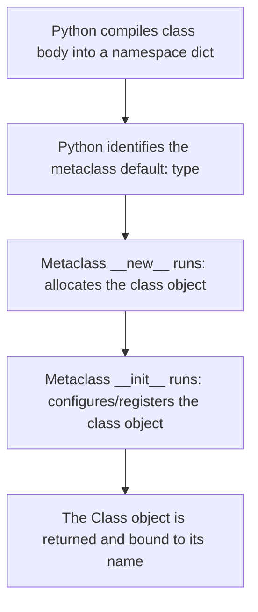

Python's object-oriented programming model is extremely dynamic. Classes are not just templates; they are first-class objects created at runtime. This section explores how to harness metaclasses, dunder methods, and dynamic class creation.

---

## 1. Abstract Base Classes (ABC)

An **Abstract Base Class (ABC)** allows you to define a set of methods that subclasses *must* implement. This enforces a strict interface or API contract in your code.

We use the built-in `abc` module, `ABC` subclass, and `@abstractmethod` decorator:

```python
from abc import ABC, abstractmethod

class PaymentGateway(ABC):
    @abstractmethod
    def process_payment(self, amount: float) -> bool:
        """Subclasses must implement this method."""
        pass

class StripePayment(PaymentGateway):
    def process_payment(self, amount: float) -> bool:
        print(f"Processing Rs. {amount} via Stripe.")
        return True

# Attempting to instantiate PaymentGateway directly will raise a TypeError:
# gateway = PaymentGateway() # TypeError: Can't instantiate abstract class PaymentGateway with abstract method process_payment
```

---

## 2. Classes are Objects (Metaclasses)

In Python, **everything is an object, including classes themselves**. When you write a `class` statement, Python executes it and creates a class object in memory.

By default, all classes are instances of the metaclass `type`:

```python
class MyClass:
    pass

print(type(MyClass))  # Output: <class 'type'>
```

### Dynamic Class Creation with `type()`
Because classes are objects, you can create them dynamically using the three-argument form of the built-in `type(name, bases, dict)` constructor:

```python
# type(name, bases_tuple, attributes_dict)
DynamicUser = type("DynamicUser", (object,), {
    "role": "Guest",
    "say_hello": lambda self: f"Hello, I am a {self.role}!"
})

user = DynamicUser()
print(user.say_hello())  # Output: "Hello, I am a Guest!"
```

---

## 3. Special Attributes: `__dict__` and `__annotations__`

Python class objects maintain internal dictionaries to manage namespaces and metadata:

### `__dict__`
The namespace dictionary containing all local attributes, functions, and methods defined directly on the object/class.

```python
class User:
    species = "Human"
    def __init__(self, name):
        self.name = name

u = User("Amit")
print(u.__dict__)     # Output: {'name': 'Amit'} (instance attributes)
print(User.__dict__)  # Output: contains 'species', '__init__', etc. (class namespace)
```

### `__annotations__`
A dictionary that stores the type hints defined on the class attributes or parameters. This dictionary is crucial for libraries performing runtime type checks.

```python
class Profile:
    username: str
    age: int

print(Profile.__annotations__)  # Output: {'username': <class 'str'>, 'age': <class 'int'>}
```

---

## 4. Dunder Methods (Magic Methods)

Dunder (Double-Underscore) methods allow you to hook into Python's built-in behaviors:

- `__new__`: The static creator method responsible for allocating memory and returning a new instance of a class. It runs *before* `__init__`.
- `__init__`: The initializer method that configures the fields on the instance returned by `__new__`.
- `__call__`: Allows instances of your class to be called like functions.
- `__repr__` / `__str__`: Control how your object is converted to a string.

```python
class CallableLogger:
    def __new__(cls, *args, **kwargs):
        print("1. Memory allocated via __new__")
        return super().__new__(cls)
        
    def __init__(self, prefix):
        print("2. Instance initialized via __init__")
        self.prefix = prefix
        
    def __call__(self, message):
        print(f"[{self.prefix}] {message}")

logger = CallableLogger("SYSTEM") # Allocates and initializes
logger("Service started")         # Callable! Output: "[SYSTEM] Service started"
```

---

## 5. Class Creation Stages

When a class definition is executed, Python goes through distinct stages to build the class object using its metaclass:



To intercept this creation pipeline, you define a custom metaclass subclassing `type`.

---

## 6. Real-World Framework Implementations

Advanced OOP mechanics are the backbone of modern Python frameworks:

### SQLAlchemy (Declarative Bases)
SQLAlchemy uses metaclasses to inspect class attributes and map them automatically to relational database columns:
- When you define a class inheriting from `DeclarativeBase`, SQLAlchemy's metaclass intercepts the class definition.
- It parses class attributes (like `id = Column(Integer)`) and reads the class name to register database tables.
- It maps the class attributes to query descriptors, meaning when you assign `user.name = "Rahul"`, it tracks database updates dynamically.

### FastAPI / Pydantic (BaseModel)
Pydantic uses metaclasses and annotations to perform automatic serialization and data validation:
- When a class inheriting from Pydantic's `BaseModel` is created, Pydantic's metaclass reads `__annotations__` at runtime.
- It builds validator functions based on types (e.g. `age: int` generates an integer parser).
- FastAPI intercepts HTTP requests, passes them to Pydantic schemas, and raises detailed parsing errors if values don't match, all before your endpoint function runs.

---

## Practice & Exercises

To reinforce what you've learned in this section (Abstract Classes, Metaclasses, and Dunder hooks), practice with these interactive notebooks:

<CardGroup cols={2}>
  <Card
    title="Follow-Along Practice"
    icon="laptop-code"
  >
    Practice creating Abstract classes, hook __new__, dynamically create classes, and inspect annotations.

    [💻 VS Code](vscode://file/Users/sivaprasad/Downloads/python%20material/python4ai/public/notebooks/basics_exercises/Advanced_OOP_Practice.ipynb) | [🚀 Colab](https://colab.research.google.com/github/prasad230776/python4ai/blob/master/public/notebooks/basics_exercises/Advanced_OOP_Practice.ipynb) | <a href="/public/notebooks/basics_exercises/Advanced_OOP_Practice.ipynb" download>📥 Download</a>
  </Card>
  <Card
    title="Practice Exercises"
    icon="pen-to-square"
  >
    Test your advanced OOP understanding with custom exercises on interface enforcement and metaclass inspectors.

    [💻 VS Code](vscode://file/Users/sivaprasad/Downloads/python%20material/python4ai/public/notebooks/basics_exercises/Advanced_OOP_Exercises.ipynb) | [🚀 Colab](https://colab.research.google.com/github/prasad230776/python4ai/blob/master/public/notebooks/basics_exercises/Advanced_OOP_Exercises.ipynb) | <a href="/public/notebooks/basics_exercises/Advanced_OOP_Exercises.ipynb" download>📥 Download</a>
  </Card>
</CardGroup>

---

## What's next?

Learn about how to validate your data using Type Hints, Dataclasses, and Pydantic!

<Card
  title="Introduction to Pydantic"
  icon="arrow-right"
  href="/advanced-python/pydantic/introduction"
>
  Learn runtime type validation and Pydantic models
</Card>
