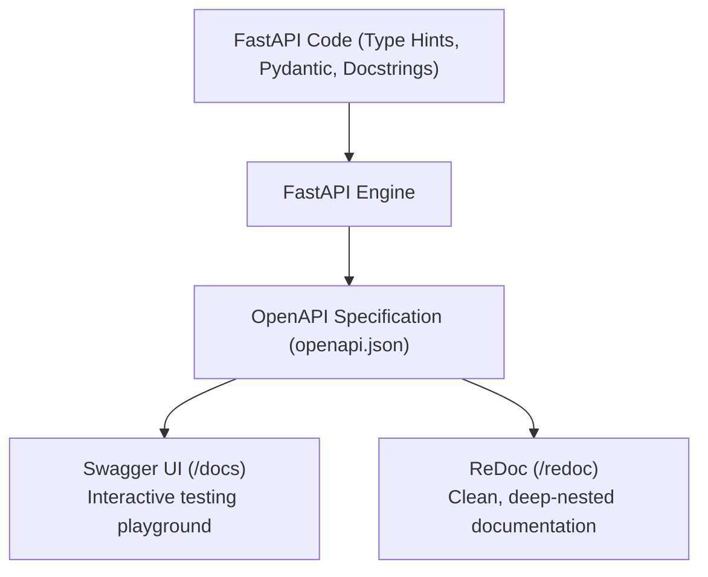

One of FastAPI's most popular features is its **automatic, interactive API documentation**. It reads your Python code, type hints, and Pydantic schemas, generates a standard **OpenAPI specification** JSON, and hosts interactive web portals where clients can test your endpoints live.

---

## 1. Documentation Generation Architecture

FastAPI acts as a compiler that translates Python code annotations directly into standardized documentation layers.



---

## 2. Interactive Documentation Portals

When your FastAPI application is running locally (e.g., at `http://127.0.0.1:8000`), you get access to two built-in UI pages:

### A. Swagger UI (`/docs`)
* Accessible at `http://127.0.0.1:8000/docs`
* **Features**: Allows you to view endpoint structures, inspect request body models, and hit the **"Try it out"** button to execute actual HTTP requests directly from your browser.

### B. ReDoc (`/redoc`)
* Accessible at `http://127.0.0.1:8000/redoc`
* **Features**: Provides a highly structured, clean layout optimized for developers referencing documentation, though it does not allow executing live requests.

---

## 3. Customizing Your API Documentation

FastAPI provides numerous metadata options to make your API documentation look highly professional and descriptive.

### A. App-Level Metadata
Modify the main `FastAPI` application instance to add global titles, logos, and descriptions:

```python
from fastapi import FastAPI

app = FastAPI(
    title="🏢 Employee Management System (EMS) API",
    description="""
    Welcome to the enterprise **Employee Management System** portal.
    
    This API allows you to:
    * **Manage Employee Directories** (Create, read, update, delete employee profiles).
    * **Department Structuring** (Organize teams and roles).
    * **Real-time Communication** (Send peer-to-peer and group messages).
    """,
    version="1.0.0",
    contact={
        "name": "EMS Support Team",
        "email": "support@company.com"
    }
)
```

### B. Route-Level Metadata
Use route parameters to document endpoint-specific behaviors:

```python
from fastapi import status, APIRouter

router = APIRouter()

@router.post(
    "/employees",
    status_code=status.HTTP_201_CREATED,
    summary="Onboard a new employee",
    description="Registers a new employee inside the database, creates their default profile, and alerts HR.",
    response_description="The newly created employee profile details including database ID"
)
def create_employee():
    return {"message": "Success"}
```

* **`summary`**: A short name/title for the endpoint.
* **`description`**: A detailed markdown block describing what the endpoint does internally.
* **`response_description`**: Explains what the returned payload represents.

### C. Parameter and Field Descriptions
Explain what individual query parameters, path variables, or Pydantic fields represent:

```python
from pydantic import BaseModel, Field
from fastapi import Query

class EmployeeCreate(BaseModel):
    name: str = Field(..., min_length=2, description="The first and last name of the employee.")
    salary: float = Field(..., gt=0, description="The monthly gross salary in USD.")

@app.get("/employees")
def list_employees(
    limit: int = Query(10, description="Maximum number of employee records to return in the list.")
):
    return []
```

All of these descriptions are parsed and rendered directly into the Swagger UI and ReDoc pages, providing a self-documenting API that stays in sync with your code!
