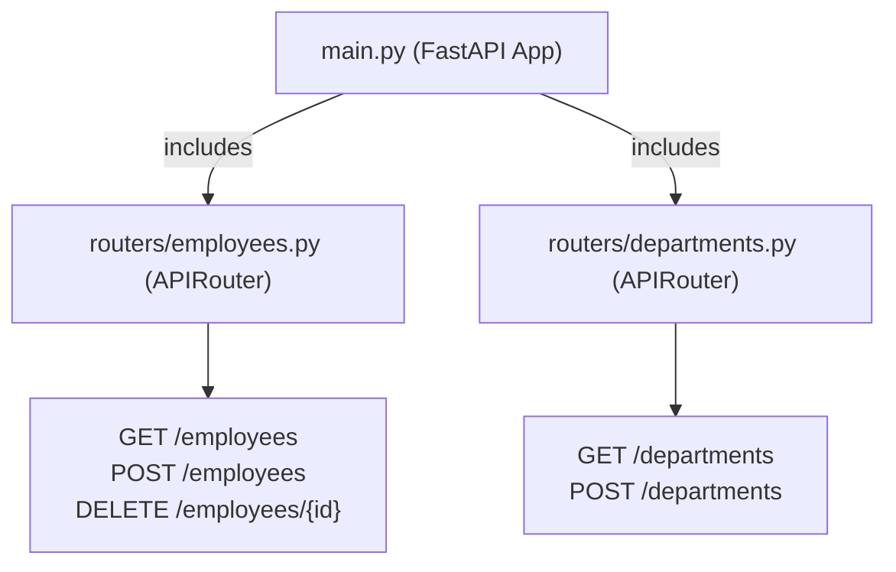

As your application grows, keeping all API endpoints in a single `main.py` file becomes unmaintainable. FastAPI provides the **`APIRouter`** class to split routes into clean, self-contained files that can be easily plugged into the main application.

---

## 1. Modular Router Architecture

Instead of having a monolithic `main.py`, we organize routes by domain (e.g. employees, departments). The main app acts as a hub that imports and attaches (includes) these sub-routers.



---

## 2. Creating a Sub-Router

Let's implement a clean sub-router for handling employee-related endpoints.

Create a file named `routers/employees.py` (ensure the parent folder exists):

```python
# routers/employees.py
from fastapi import APIRouter, HTTPException, status
from pydantic import BaseModel

# 1. Create the APIRouter instance
router = APIRouter(
    prefix="/employees",
    tags=["Employees"]
)

class Employee(BaseModel):
    id: int
    name: str
    department: str

# Sample Mock Database
EMPLOYEES = [
    Employee(id=1, name="Alice", department="Engineering"),
    Employee(id=2, name="Bob", department="HR")
]

# 2. Add endpoints using @router instead of @app
@router.get("/", response_model=list[Employee])
def list_employees():
    return EMPLOYEES

@router.get("/{emp_id}", response_model=Employee)
def get_employee(emp_id: int):
    for emp in EMPLOYEES:
        if emp.id == emp_id:
            return emp
    raise HTTPException(status_code=404, detail="Employee not found")
```

### Explaining the APIRouter parameters:
* **`prefix="/employees"`**: Automatically prefixes all routes in this file. So `@router.get("/")` becomes accessible via `/employees/`, and `@router.get("/{emp_id}")` becomes `/employees/{emp_id}`.
* **`tags=["Employees"]`**: Groups these endpoints under a dedicated "Employees" section in the auto-generated Swagger UI documentation.

---

## 3. Registering Routers in `main.py`

Once a router is defined, you must register it in the main application file using `app.include_router()`.

```python
# main.py
from fastapi import FastAPI
# Import the employee router we created
from routers import employees

app = FastAPI(title="Employee Management System")

# Register the sub-router
app.include_router(employees.router)

@app.get("/")
def home():
    return {"message": "Welcome to the Modular EMS API!"}
```

---

## 4. Scalable Folder Layout

For a modular project, arrange your folders like this:

```text
my_project/
│
├── main.py                # App entrypoint
├── routers/               # APIRouter files
│   ├── __init__.py        # Makes routers a package
│   ├── employees.py       # Employee route endpoints
│   └── departments.py     # Department route endpoints
```

This structure makes it incredibly simple to add new resource modules (e.g., adding `chats.py` or `payroll.py` later as our Employee Management System grows) without cluttering our main application entrypoint.
