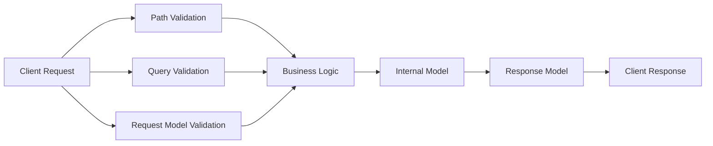
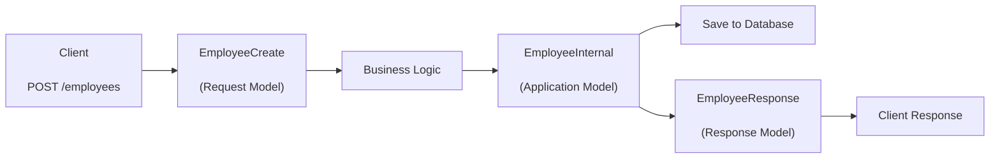

FastAPI is designed around a simple idea:

> **Validate all incoming data, process it internally, and return only the data that clients should see.**

Throughout this chapter, we'll build a simple **Employee Management System** to understand how FastAPI validates and processes data.

Our API supports:

- Retrieve an employee
- Search employees
- Create an employee

Internally, an employee contains much more information than what the client sends or receives.

```text
Employee
├── id
├── name
├── department
├── salary
├── employee_code
├── tax_id
└── joined_at
```

---

# Request Processing Flow

Every request passes through multiple validation stages before reaching your business logic.



FastAPI validates incoming data, your application performs the business logic, and FastAPI validates the outgoing response before sending it back to the client.

---

# 1. Path Parameter Validation

Path parameters identify a specific resource.

Example request

```http
GET /employees/101
```

```python
from typing import Annotated

from fastapi import FastAPI, Path

app = FastAPI()

@app.get("/employees/{employee_id}")
def get_employee(
    employee_id: Annotated[int, Path(gt=0)]
):
    return {"employee_id": employee_id}
```

### What FastAPI validates

- Must be an integer.
- Must be greater than zero.

If the client sends

```http
GET /employees/abc
```

or

```http
GET /employees/-5
```

FastAPI automatically returns a **422 Unprocessable Entity** response.

---

# 2. Query Parameter Validation

Query parameters are used to filter, search, sort, or paginate results.

Example request

```http
GET /employees?department=Engineering&limit=10
```

```python
from typing import Annotated

from fastapi import Query

@app.get("/employees")
def list_employees(
    department: str | None = None,
    limit: Annotated[int, Query(ge=1, le=100)] = 10
):
    return {
        "department": department,
        "limit": limit
    }
```

### What FastAPI validates

- `department` is optional.
- `limit` must be between **1** and **100**.

---

# 3. Request Body Validation

When creating or updating resources, clients send JSON in the request body.

Example request

```http
POST /employees
```

```json
{
    "name": "Alice",
    "department": "Engineering",
    "salary": 8500
}
```

To validate this JSON, create a **Request Model**.

```python
from pydantic import BaseModel, Field

class EmployeeCreate(BaseModel):
    name: str = Field(..., min_length=2)
    department: str
    salary: float = Field(..., gt=0)
```

Use it in your endpoint.

```python
@app.post("/employees")
def create_employee(employee: EmployeeCreate):

    return employee.model_dump()
```

FastAPI automatically:

- Reads the JSON request body.
- Validates the incoming data.
- Creates an `EmployeeCreate` object.
- Passes the validated object to the route function.

If validation fails, FastAPI immediately returns **422 Unprocessable Entity** without executing your function.

---

# 4. Why Isn't the Request Model Enough?

The **Request Model** represents only the data that the **client is allowed to send**.

For simple applications, this is often enough.

```text
Client
   │
   ▼
EmployeeCreate
```

However, a real application usually needs additional information.

When creating an employee, the application may generate:

- Employee ID
- Employee Code
- Tax ID
- Joining Date
- Created Timestamp

These values should **never come from the client**.

Therefore, the request model is not the application's complete working model.

---

# 5. Internal Model

After validation, the application creates its own internal model.

```python
from datetime import datetime
from pydantic import BaseModel

class EmployeeInternal(BaseModel):
    id: int
    name: str
    department: str
    salary: float
    employee_code: str
    tax_id: str
    joined_at: datetime
```

Business logic transforms the request model into the internal model.

```python
from datetime import datetime

@app.post("/employees")
def create_employee(employee: EmployeeCreate):

    internal_employee = EmployeeInternal(
        id=101,
        name=employee.name,
        department=employee.department,
        salary=employee.salary,
        employee_code="EMP-101",
        tax_id="TAX123",
        joined_at=datetime.now()
    )

    # Save internal_employee to the database

    return {"message": "Employee created successfully"}
```

The client never sends:

- `id`
- `employee_code`
- `tax_id`
- `joined_at`

These values are generated by the application.

---

# 6. Response Models

The application should not expose its internal model directly.

Instead, create a **Response Model** containing only the fields that clients should receive.

```python
from pydantic import BaseModel

class EmployeeResponse(BaseModel):
    id: int
    name: str
    department: str
```

Use it with `response_model`.

```python
@app.post(
    "/employees",
    response_model=EmployeeResponse
)
def create_employee(employee: EmployeeCreate):

    internal_employee = EmployeeInternal(
        id=101,
        name=employee.name,
        department=employee.department,
        salary=employee.salary,
        employee_code="EMP-101",
        tax_id="TAX123",
        joined_at=datetime.now()
    )

    return internal_employee
```

Although `EmployeeInternal` contains

- salary
- employee_code
- tax_id
- joined_at

the client only receives

```json
{
    "id": 101,
    "name": "Alice",
    "department": "Engineering"
}
```

FastAPI automatically filters the response using `EmployeeResponse`.

---

# Complete Employee Lifecycle



---

# Validation Tools

FastAPI provides different validation helpers depending on where the data comes from.

## `Field()` – Request Body Validation

Used inside Pydantic models.

```python
from typing import Annotated
from pydantic import BaseModel, Field

class Student(BaseModel):
    name: Annotated[str, Field(min_length=3, max_length=50)]
    age: Annotated[int, Field(gt=0, lt=100)]
```

---

## `Query()` – Query Parameter Validation

```python
from typing import Annotated
from fastapi import Query

limit: Annotated[int, Query(ge=1, le=100)] = 20
```

---

## `Path()` – Path Parameter Validation

```python
from typing import Annotated
from fastapi import Path

employee_id: Annotated[int, Path(gt=0)]
```

---

# `Annotated` (Recommended)

In Pydantic v2, the recommended way to specify validation is using `Annotated`.

Syntax

```python
Annotated[type, validation]
```

Example

```python
from typing import Annotated
from pydantic import Field

age: Annotated[int, Field(gt=0, lt=100)]
```

Older syntax

```python
age: int = Field(gt=0, lt=100)
```

Both work, but `Annotated` is now the recommended style.

---

# Common Validation Options

| Option | Purpose |
|---------|---------|
| `gt` | Greater than |
| `ge` | Greater than or equal |
| `lt` | Less than |
| `le` | Less than or equal |
| `min_length` | Minimum string length |
| `max_length` | Maximum string length |
| `pattern` | Regular expression |
| `default` | Default value |
| `alias` | Alternate parameter name |
| `title` | Title shown in API docs |
| `description` | Description shown in API docs |
| `examples` | Example values |

---

# Common Pydantic Types

| Type | Purpose |
|------|---------|
| `EmailStr` | Validates email addresses |
| `AnyUrl` | Validates URLs |
| `UUID` | Validates UUID values |
| `date` | Date |
| `datetime` | Date and time |
| `Decimal` | High-precision decimal |

Example

```python
from pydantic import BaseModel, EmailStr

class Student(BaseModel):
    email: EmailStr
```

> **Note:** `EmailStr` requires the `email-validator` package.

```bash
pip install email-validator
```

---

# Summary

| Stage | Validation / Model | Purpose |
|--------|--------------------|---------|
| `GET /employees/{id}` | `Path()` | Validate path parameters |
| `GET /employees?department=HR&limit=10` | `Query()` | Validate query parameters |
| `POST /employees` | `EmployeeCreate` + `Field()` | Validate incoming request body |
| Business Logic | `EmployeeInternal` | Internal application processing |
| Response | `EmployeeResponse` | Return only safe data to clients |

> **Best Practice:** As your application grows, use separate models for **Request**, **Internal Processing**, and **Response**. Each model has a single responsibility:
>
> - **Request Model** → validates incoming client data.
> - **Internal Model** → represents the application's complete working object.
> - **Response Model** → exposes only the data that clients should receive.