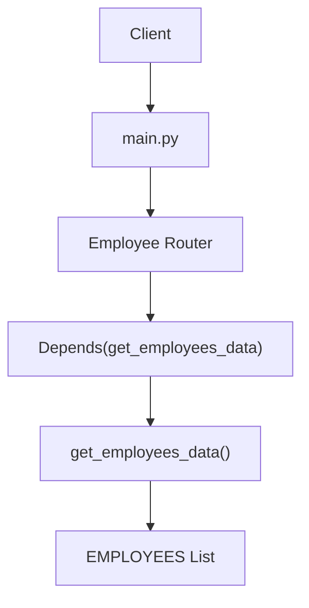
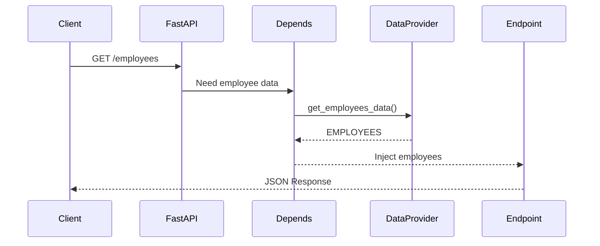
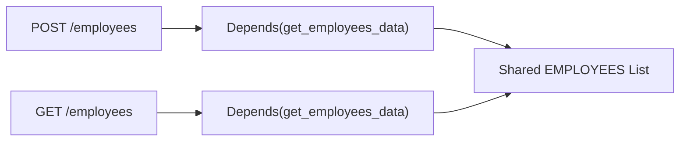

## Dependency Injection (DI)

In the previous lesson, we organized our Employee Management System using **APIRouter**.

Each resource (Employees, Departments, etc.) had its own router, making the application modular and easy to maintain.

Now we'll introduce another important FastAPI feature:

> **Dependency Injection (DI)**

Rather than creating or retrieving required objects inside every endpoint, FastAPI can automatically **provide (inject)** them using `Depends()`.

In this lesson, we'll use a simple **in-memory employee list** to understand the concept. Later, we'll replace it with a real database session without changing the endpoint structure.

## Goal

We will build an Employee Management System where:

- Employee data is stored in one place.
- Endpoints do **not** access the data directly.
- FastAPI automatically injects the data into each endpoint using `Depends()`.
- Multiple endpoints can read and update the same shared data.

## Application Architecture



## Step 1. Create the FastAPI Application

### Task

Create the main FastAPI application.

```python
# main.py

from fastapi import FastAPI

app = FastAPI(title="Employee Management System")
```

At this stage, the application starts successfully but has no endpoints.

## Step 2. Create a Shared Data Provider

### Task

Create a reusable function that provides employee data.

Create a file named **data.py**.

```python
# data.py

EMPLOYEES = [
    {"id": 1, "name": "Alice", "department": "Engineering"},
    {"id": 2, "name": "Bob", "department": "HR"},
    {"id": 3, "name": "Charlie", "department": "Finance"}
]

def get_employees_data():
    return EMPLOYEES
```

### What does this accomplish?

- Employee data is stored in one place.
- Every endpoint can reuse it.
- The endpoint doesn't need to know where the data comes from.

## Step 3. Create the Employee Router

### Task

Create a router responsible for employee operations.

```python
# routers/employees.py

from fastapi import APIRouter

router = APIRouter(
    prefix="/employees",
    tags=["Employees"]
)
```

## Step 4. Inject the Dependency

### Task

Ask FastAPI to automatically provide employee data whenever an endpoint is executed.

```python
from fastapi import Depends

from data import get_employees_data

@router.get("/")
def list_employees(
    employees = Depends(get_employees_data)
):
    return employees
```

Notice that we never write:

```python
employees = get_employees_data()
```

Instead we simply write:

```python
employees = Depends(get_employees_data)
```

This tells FastAPI:

> **"Before executing this endpoint, call `get_employees_data()` and pass its result into the `employees` parameter."**

## Step 5. Read Individual Employees

### Task

Reuse the same dependency in another endpoint.

```python
@router.get("/{emp_id}")
def get_employee(
    emp_id: int,
    employees = Depends(get_employees_data)
):
    for employee in employees:
        if employee["id"] == emp_id:
            return employee

    return {"message": "Employee not found"}
```

Notice that both endpoints receive the employee list automatically.

## Step 6. Add a New Employee

### Task

Update the shared employee list.

```python
@router.post("/")
def add_employee(
    employee: dict,
    employees = Depends(get_employees_data)
):
    employees.append(employee)
    return employee
```

No code was required to retrieve the employee list.

FastAPI injected it automatically.

## Step 7. Update an Employee

### Task

Modify an existing employee.

```python
@router.put("/{emp_id}")
def update_employee(
    emp_id: int,
    updated_employee: dict,
    employees = Depends(get_employees_data)
):
    for index, employee in enumerate(employees):
        if employee["id"] == emp_id:
            employees[index] = updated_employee
            return updated_employee

    return {"message": "Employee not found"}
```

Again, the endpoint only performs business logic.

The dependency is supplied automatically.

## Step 8. Delete an Employee

### Task

Remove an employee from the shared list.

```python
@router.delete("/{emp_id}")
def delete_employee(
    emp_id: int,
    employees = Depends(get_employees_data)
):
    for employee in employees:
        if employee["id"] == emp_id:
            employees.remove(employee)
            return {"message": "Employee deleted"}

    return {"message": "Employee not found"}
```

## Step 9. Register the Router

### Task

Connect the router to the FastAPI application.

```python
# main.py

from fastapi import FastAPI

from routers import employees

app = FastAPI(title="Employee Management System")

app.include_router(employees.router)
```

## What Actually Happens?

Suppose the client sends:

```text
GET /employees
```

FastAPI automatically performs these steps:

1. Receives the request.
2. Finds `Depends(get_employees_data)`.
3. Calls `get_employees_data()`.
4. Receives the employee list.
5. Injects it into the endpoint.
6. Executes the endpoint.
7. Returns the response.

## Request Flow



## Why Can We Update the List?

The dependency returns the **same list object** every time.

```python
EMPLOYEES = [...]

def get_employees_data():
    return EMPLOYEES
```

It does **not** create a new list.

Every endpoint receives a reference to the same shared object.

For example,

```python
employees.append(new_employee)
```

actually modifies the original `EMPLOYEES` list.

Therefore,

```text
POST /employees
```

adds an employee, and later

```text
GET /employees
```

returns the updated list.

## Shared Data Flow



Both endpoints receive the **same** shared list.

## Without Dependency Injection

Without DI, every endpoint retrieves the dependency itself.

```python
@router.get("/")
def list_employees():

    employees = get_employees_data()

    return employees
```

Another endpoint repeats exactly the same code.

```python
@router.post("/")
def add_employee(employee: dict):

    employees = get_employees_data()

    employees.append(employee)

    return employee
```

The code becomes repetitive.

## With Dependency Injection

Using DI, the endpoint simply declares what it needs.

```python
@router.post("/")
def add_employee(
    employee: dict,
    employees = Depends(get_employees_data)
):
    employees.append(employee)
    return employee
```

FastAPI supplies the dependency automatically.

The endpoint focuses only on business logic.

## How FastAPI Thinks

When FastAPI sees:

```python
employees = Depends(get_employees_data)
```

it internally behaves as if it had written:

```python
employees = get_employees_data()

list_employees(employees)
```

You never write this code yourself.

FastAPI performs it automatically for every request.

## Why Is This Useful?

Today, the dependency returns a simple Python list.

```python
employees = Depends(get_employees_data)
```

Tomorrow, it could return:

- a database session
- the current user
- application settings
- a logger
- an email service
- a repository
- a service object

The endpoint code stays almost exactly the same.

Only the dependency changes.

## Looking Ahead

Today's dependency:

```python
employees = Depends(get_employees_data)
```

will later become:

```python
db: Session = Depends(get_db)
```

Notice that only the injected object changes.

The Dependency Injection mechanism remains exactly the same.

This is why understanding DI with a simple Python list makes learning database integration much easier.

## Summary

- Dependency Injection (DI) allows FastAPI to automatically provide required objects to an endpoint.
- `Depends()` tells FastAPI which dependency should be injected.
- The endpoint never creates or retrieves the dependency itself.
- Multiple endpoints can reuse the same dependency.
- Because the dependency returns the same shared list, endpoints can both **read** and **modify** it.
- Later, the same pattern will be used to inject a database session using `Depends(get_db)`.
- DI keeps code clean, reusable, and focused on business logic.