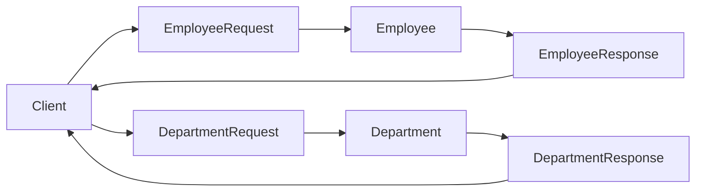
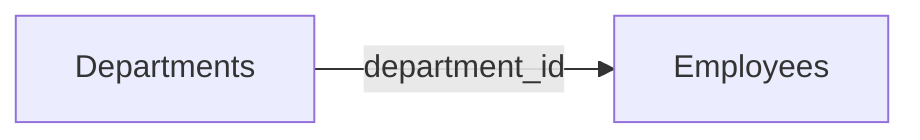

## Project Overview

In this project, we'll build a simple **Employee Management System**.

To keep the focus on FastAPI concepts, we'll store data in Python lists instead of a database.

By completing this project, you'll learn how to build a real REST API using FastAPI.

## What You'll Build

Our application manages two resources:

- Employees
- Departments

Each employee belongs to one department.

Example:

```text
Department
-----------
1  Engineering
2  HR

Employee
-----------
1  Alice   Engineering
2  Bob     HR
```

## APIs We'll Build

### Employee APIs

| Method | Endpoint | Purpose |
|---------|----------|---------|
| GET | `/employees` | View all employees |
| GET | `/employees/{id}` | View one employee |
| POST | `/employees` | Add employee |
| PUT | `/employees/{id}` | Update employee |
| DELETE | `/employees/{id}` | Delete employee |

### Department APIs

| Method | Endpoint | Purpose |
|---------|----------|---------|
| GET | `/departments` | View all departments |
| POST | `/departments` | Add department |

Later we'll enhance the Employee API with filtering.

Example:

```text
GET /employees?department_id=1

GET /employees?min_age=25

GET /employees?name=alice
```

## Concepts We'll Learn

During this project we'll gradually introduce:

- APIRouter
- Dependency Injection
- Request Models
- Response Models
- Request Body Validation
- Path Parameter Validation
- Query Parameter Validation
- Exception Handling
- HTTP Status Codes

Don't worry if some of these terms are unfamiliar—we'll learn them step by step.

## Project Structure

```text
employee_management/

main.py
models.py
data.py

routers/
    employees.py
    departments.py
```

## Development Plan

We'll build the project one feature at a time.

| Step | We'll Learn |
|------|-------------|
| 1 | Create the FastAPI application |
| 2 | Create request models |
| 3 | Create the in-memory data |
| 4 | Create routers |
| 5 | Use Dependency Injection |
| 6 | Build Employee CRUD |
| 7 | Build Department APIs |
| 8 | Add validation |
| 9 | Handle exceptions |
| 10 | Add filtering using query parameters |

At every step:

- Read the task.
- Try it yourself.
- Test it in Swagger UI.
- Open the solution only if needed.

By the end of this project, you'll have built a complete Employee Management API using only FastAPI fundamentals.

## Step 2 - Create the Models

### Task

Before writing any APIs, define the data our application will manage.

Based on the project requirements, create models for the following resources. Try implementing them yourself before opening the solution.

## Employee Structure

| Field | Type | Required | Validation |
|------|------|:--------:|------------|
| id | Integer | Yes | Positive |
| name | String | Yes | 3–40 characters |
| age | Integer | Yes | 18–60 |
| salary | Float | Yes | Greater than 0 |
| email | Email | Yes | Valid email address |
| department_id | Integer | Yes | Positive |

**Example**

```json
{
  "id": 1,
  "name": "Alice",
  "age": 28,
  "salary": 65000,
  "email": "alice@example.com",
  "department_id": 1
}
```

## Department Structure

| Field | Type | Required | Validation |
|------|------|:--------:|------------|
| id | Integer | Yes | Positive |
| name | String | Yes | 2–30 characters |

**Example**

```json
{
  "id": 1,
  "name": "Engineering"
}
```

## Models to Create

| Model | Purpose |
|------|---------|
| EmployeeRequest | Data received while creating or updating an employee |
| Employee | Represents an employee inside the application |
| EmployeeResponse | Data returned to the client |
| DepartmentRequest | Data received while creating or updating a department |
| Department | Represents a department inside the application |
| DepartmentResponse | Data returned to the client |

Before opening the solution, think about this:

> Should the client send the employee **id** while creating a new employee?

If your answer is **No**, which model should contain the `id` field?

## Solution

### Employee Request Model

Used while creating or updating an employee. Notice that the client does **not** send the employee ID.

<Accordion title="EmployeeRequest">

```python
from pydantic import BaseModel, EmailStr, Field

class EmployeeRequest(BaseModel):
    name: str = Field(
        min_length=3,
        max_length=40
    )
    age: int = Field(
        ge=18,
        le=60
    )
    salary: float = Field(
        gt=0
    )
    email: EmailStr
    department_id: int = Field(
        gt=0
    )
```

</Accordion>

### Employee Business Model

Represents an employee inside the application.

<Accordion title="Employee">

```python
class Employee(BaseModel):
    id: int
    name: str
    age: int
    salary: float
    email: EmailStr
    department_id: int
```

</Accordion>

### Employee Response Model

Returned to the client.

<Accordion title="EmployeeResponse">

```python
class EmployeeResponse(BaseModel):
    id: int
    name: str
    age: int
    salary: float
    email: EmailStr
    department_id: int
```

</Accordion>

### Department Request Model

Used while creating or updating a department.

<Accordion title="DepartmentRequest">

```python
class DepartmentRequest(BaseModel):
    name: str = Field(
        min_length=2,
        max_length=30
    )
```

</Accordion>

### Department Business Model

Represents a department inside the application.

<Accordion title="Department">

```python
class Department(BaseModel):
    id: int
    name: str
```

</Accordion>

### Department Response Model

Returned to the client.

<Accordion title="DepartmentResponse">

```python
class DepartmentResponse(BaseModel):
    id: int
    name: str
```

</Accordion>

## Model Flow



## Why Three Models?

| Model | Responsibility |
|------|----------------|
| **Request Model** | Validates incoming data from the client |
| **Business Model** | Represents data inside the application |
| **Response Model** | Controls what data is returned to the client |

For example, when creating an employee, the client sends:

```json
{
  "name": "Alice",
  "age": 28,
  "salary": 65000,
  "email": "alice@example.com",
  "department_id": 1
}
```

The application stores it as:

```json
{
  "id": 1,
  "name": "Alice",
  "age": 28,
  "salary": 65000,
  "email": "alice@example.com",
  "department_id": 1
}
```

Finally, the API returns:

```json
{
  "id": 1,
  "name": "Alice",
  "age": 28,
  "salary": 65000,
  "email": "alice@example.com",
  "department_id": 1
}
```

Notice that the **client never sends the `id`**. It is generated by the application.

## Key Takeaways

- Use **Request Models** to validate client input.
- Use **Business Models** to represent data inside the application.
- Use **Response Models** to control API responses.
- Separating models keeps the application clean and makes it easier to evolve as requirements change.

## Step 3 - Create the In-Memory Database

### Task

Before implementing the APIs, we need a place to store our data.

Instead of using a real database, we'll use Python lists as an **in-memory database**.

This allows us to focus on learning FastAPI without worrying about database configuration.

Later, we can replace these lists with a real database without changing the API design.

## Data Structure

We'll maintain two collections:

- **EMPLOYEES** – Stores employee records.
- **DEPARTMENTS** – Stores department records.

The employee's `department_id` should refer to an existing department.



## Sample Data

Create a file named **data.py**.

## Data to Store

### Departments

Create the following department objects.

| id | name |
|---:|------|
| 1 | Engineering |
| 2 | HR |
| 3 | Finance |

### Employees

Create the following employee objects.

| id | name | age | salary | email | department_id |
|---:|------|---:|-------:|-----------------------|--------------:|
| 1 | Alice | 28 | 65000 | alice@example.com | 1 |
| 2 | Bob | 35 | 72000 | bob@example.com | 2 |
| 3 | Charlie | 30 | 58000 | charlie@example.com | 1 |
| 4 | David | 26 | 45000 | david@example.com | 3 |

Using these values, create two Python lists:

- `DEPARTMENTS`
- `EMPLOYEES`

Each list should contain objects of the appropriate business model (`Department` and `Employee`).

Try creating the lists yourself before viewing the solution.

## Sample Data

Create a file named **data.py**.

<Accordion title="data.py">

```python
from models import Employee, Department

DEPARTMENTS = [
    Department(
        id=1,
        name="Engineering"
    ),
    Department(
        id=2,
        name="HR"
    ),
    Department(
        id=3,
        name="Finance"
    )
]

EMPLOYEES = [
    Employee(
        id=1,
        name="Alice",
        age=28,
        salary=65000,
        email="alice@example.com",
        department_id=1
    ),
    Employee(
        id=2,
        name="Bob",
        age=35,
        salary=72000,
        email="bob@example.com",
        department_id=2
    ),
    Employee(
        id=3,
        name="Charlie",
        age=30,
        salary=58000,
        email="charlie@example.com",
        department_id=1
    ),
    Employee(
        id=4,
        name="David",
        age=26,
        salary=45000,
        email="david@example.com",
        department_id=3
    )
]
```

</Accordion>

## Step 4 - Create the Routers

### Task

Create separate routers for managing employees and departments.

Instead of placing every endpoint inside `main.py`, we'll organize related endpoints into separate files.

This approach makes the application easier to read, maintain, and extend.

By the end of this step, your project structure should look like this:

```text
employee_management/

│── main.py
│── models.py
│── data.py
│
└── routers/
    ├── __init__.py
    ├── employees.py
    └── departments.py
```

## Router Responsibilities

Each router is responsible for a single resource.

| Router | Responsibility |
|--------|----------------|
| employees.py | Employee APIs |
| departments.py | Department APIs |

## Create the Employee Router

Create a file named **routers/employees.py**.

Try creating the router yourself before viewing the solution.

<Accordion title="employees.py">

```python
from fastapi import APIRouter

router = APIRouter(
    prefix="/employees",
    tags=["Employees"]
)
```

</Accordion>

## Create the Department Router

Create a file named **routers/departments.py**.

Try creating the router yourself before viewing the solution.

<Accordion title="departments.py">

```python
from fastapi import APIRouter

router = APIRouter(
    prefix="/departments",
    tags=["Departments"]
)
```

</Accordion>

## Register the Routers

Now connect both routers to the FastAPI application.

Open **main.py** and register them.

Try implementing it before viewing the solution.

<Accordion title="main.py">

```python
from fastapi import FastAPI

from routers import employees
from routers import departments

app = FastAPI(
    title="Employee Management System"
)

app.include_router(employees.router)
app.include_router(departments.router)


@app.get("/")
def home():
    return {
        "message": "Welcome to Employee Management System"
    }
```

</Accordion>

## Understanding APIRouter

The router is created using:

```python
router = APIRouter(
    prefix="/employees",
    tags=["Employees"]
)
```

### prefix

The prefix is automatically added to every endpoint inside the router.

For example,

```python
@router.get("/")
```

becomes

```text
GET /employees
```

Similarly,

```python
@router.get("/{id}")
```

becomes

```text
GET /employees/{id}
```

### tags

The `tags` parameter groups related endpoints together in the Swagger UI.

Instead of displaying all APIs in one long list, Swagger organizes them into sections.

```text
Employees
    GET /employees
    POST /employees

Departments
    GET /departments
    POST /departments
```

## What We've Accomplished

At this stage:

- The application is modular.
- Employee APIs have their own router.
- Department APIs have their own router.
- Both routers are registered with the FastAPI application.
- Swagger will automatically organize the endpoints by resource.

The routers are currently empty.

In the next step, we'll implement our first API:

```text
GET /employees
```

using **Dependency Injection** to retrieve employee data.

## Step 5 - Implement the Get All Employees API

### Task

Implement an API to retrieve all employees.

**Requirements**

- Method: `GET`
- URL: `/employees`
- Use `Depends(get_employee_data)`
- Return all employees
- Use `list[EmployeeResponse]` as the response model

Try implementing the endpoint before viewing the solution.

<Accordion title="employees.py">

```python
from fastapi import APIRouter, Depends

from data import get_employee_data
from models import Employee, EmployeeResponse

router = APIRouter(prefix="/employees", tags=["Employees"])


@router.get("", response_model=list[EmployeeResponse])
def get_employees(employees: list[Employee] = Depends(get_employee_data)):
    return employees
```

</Accordion>

### Test

```
GET /employees
```

Expected Result

- Status Code: **200 OK**
- Returns all employees.
## Step 6 - Implement the Get Employee by ID API

### Task

Implement an API to retrieve a single employee using the employee ID.

**Requirements**

- Method: `GET`
- URL: `/employees/{emp_id}`
- Use `Depends(get_employee_data)`
- Use `Path()` validation
- Return `EmployeeResponse`
- Return **404 Not Found** if the employee does not exist

Try implementing the endpoint before viewing the solution.

<Accordion title="employees.py">

```python
from typing import Annotated

from fastapi import APIRouter, Depends, HTTPException, Path, status

from data import get_employee_data
from models import Employee, EmployeeResponse

router = APIRouter(prefix="/employees", tags=["Employees"])


@router.get("/{emp_id}", response_model=EmployeeResponse)
def get_employee(
    emp_id: Annotated[int, Path(gt=0, description="Employee ID")],
    employees: list[Employee] = Depends(get_employee_data)
):
    for employee in employees:
        if employee.id == emp_id:
            return employee

    raise HTTPException(
        status_code=status.HTTP_404_NOT_FOUND,
        detail=f"Employee with ID {emp_id} not found."
    )
```

</Accordion>

### Test

| Request | Expected Result |
|---------|-----------------|
| `GET /employees/1` | Returns employee |
| `GET /employees/2` | Returns employee |
| `GET /employees/100` | 404 Not Found |
| `GET /employees/0` | 422 Validation Error |
| `GET /employees/-5` | 422 Validation Error |

## Step 7 - Implement the Create Employee API

### Task

Implement an API to add a new employee.

**Requirements**

- Method: `POST`
- URL: `/employees`
- Accept `EmployeeRequest` as the request body
- Use `Depends(get_employee_data)`
- Generate the next employee ID automatically
- Return the newly created employee
- Use `EmployeeResponse` as the response model
- Return **201 Created**

Try implementing the endpoint before viewing the solution.

<Accordion title="employees.py">

```python
from fastapi import APIRouter, Depends, HTTPException, Path, status
from typing import Annotated

from data import get_employee_data
from models import Employee, EmployeeRequest, EmployeeResponse

router = APIRouter(prefix="/employees", tags=["Employees"])


@router.post("", response_model=EmployeeResponse, status_code=status.HTTP_201_CREATED)
def create_employee(
    request: EmployeeRequest,
    employees: list[Employee] = Depends(get_employee_data)
):
    employee = Employee(id=len(employees) + 1, **request.model_dump())
    employees.append(employee)
    return employee
```

</Accordion>

### Test

| Request | Expected Result |
|---------|-----------------|
| Valid employee | **201 Created** |
| Missing required field | **422 Validation Error** |
| Invalid email | **422 Validation Error** |
| Age less than 18 | **422 Validation Error** |
| Salary less than or equal to 0 | **422 Validation Error** |
| Department ID less than or equal to 0 | **422 Validation Error** |

### Sample Request

```json
{
  "name": "David",
  "age": 27,
  "salary": 58000,
  "email": "david@example.com",
  "department_id": 3
}
```

### Sample Response

```json
{
  "id": 3,
  "name": "David",
  "age": 27,
  "salary": 58000,
  "email": "david@example.com",
  "department_id": 3
}
```

## Step 8 - Implement the Update Employee API

### Task

Implement an API to update an existing employee.

**Requirements**

- Method: `PUT`
- URL: `/employees/{emp_id}`
- Accept `EmployeeRequest` as the request body
- Use `Path()` validation
- Use `Depends(get_employee_data)`
- Return the updated employee
- Return **404 Not Found** if the employee does not exist

Try implementing the endpoint before viewing the solution.

<Accordion title="employees.py">

```python
@router.put("/{emp_id}", response_model=EmployeeResponse)
def update_employee(
    emp_id: Annotated[int, Path(gt=0, description="Employee ID")],
    request: EmployeeRequest,
    employees: list[Employee] = Depends(get_employee_data)
):
    for employee in employees:
        if employee.id == emp_id:
            employee.name = request.name
            employee.age = request.age
            employee.salary = request.salary
            employee.email = request.email
            employee.department_id = request.department_id
            return employee

    raise HTTPException(
        status_code=status.HTTP_404_NOT_FOUND,
        detail=f"Employee with ID {emp_id} not found."
    )
```

</Accordion>

### Test

| Request | Expected Result |
|---------|-----------------|
| Valid employee ID | Updated employee |
| Invalid employee ID | **404 Not Found** |
| `emp_id = 0` | **422 Validation Error** |
| `emp_id < 0` | **422 Validation Error** |
| Invalid request body | **422 Validation Error** |

### Sample Request

```text
PUT /employees/2
```

```json
{
  "name": "Robert",
  "age": 36,
  "salary": 78000,
  "email": "robert@example.com",
  "department_id": 2
}
```

### Sample Response

```json
{
  "id": 2,
  "name": "Robert",
  "age": 36,
  "salary": 78000,
  "email": "robert@example.com",
  "department_id": 2
}
```
## Step 9 - Implement the Delete Employee API

### Task

Implement an API to delete an existing employee.

**Requirements**

- Method: `DELETE`
- URL: `/employees/{emp_id}`
- Use `Path()` validation
- Use `Depends(get_employee_data)`
- Delete the employee if found
- Return **204 No Content**
- Return **404 Not Found** if the employee does not exist

Try implementing the endpoint before viewing the solution.

<Accordion title="employees.py">

```python
@router.delete("/{emp_id}", status_code=status.HTTP_204_NO_CONTENT)
def delete_employee(
    emp_id: Annotated[int, Path(gt=0, description="Employee ID")],
    employees: list[Employee] = Depends(get_employee_data)
):
    for employee in employees:
        if employee.id == emp_id:
            employees.remove(employee)
            return

    raise HTTPException(
        status_code=status.HTTP_404_NOT_FOUND,
        detail=f"Employee with ID {emp_id} not found."
    )
```

</Accordion>

### Test

| Request | Expected Result |
|---------|-----------------|
| Valid employee ID | **204 No Content** |
| Invalid employee ID | **404 Not Found** |
| `emp_id = 0` | **422 Validation Error** |
| `emp_id < 0` | **422 Validation Error** |

### Sample Request

```text
DELETE /employees/2
```

### Expected Response

```text
204 No Content
```
## Step 10 - Filter Employees by Department

### Task

Enhance the **Get All Employees** API to optionally filter employees by department.

**Requirements**

- Method: `GET`
- URL: `/employees`
- Accept an optional `department_id` query parameter
- Use `Query()` validation
- Return all employees if no department is specified
- Return only matching employees if `department_id` is provided

Try implementing the endpoint before viewing the solution.

<Accordion title="employees.py">

```python
from typing import Annotated

from fastapi import Depends, Query


@router.get("", response_model=list[EmployeeResponse])
def get_employees(
    department_id: Annotated[int | None, Query(gt=0, description="Department ID")] = None,
    employees: list[Employee] = Depends(get_employee_data)
):
    if department_id is None:
        return employees

    return [employee for employee in employees if employee.department_id == department_id]
```

</Accordion>

### Test

| Request | Expected Result |
|---------|-----------------|
| `GET /employees` | Returns all employees |
| `GET /employees?department_id=1` | Returns employees in department 1 |
| `GET /employees?department_id=2` | Returns employees in department 2 |
| `GET /employees?department_id=0` | **422 Validation Error** |
| `GET /employees?department_id=-1` | **422 Validation Error** |

### Sample Requests

```text
GET /employees
```

```text
GET /employees?department_id=1
```

```text
GET /employees?department_id=2
```
## Step 11 - Search Employees by Name

### Task

Enhance the **Get All Employees** API to search employees by name.

**Requirements**

- Method: `GET`
- URL: `/employees`
- Accept an optional `name` query parameter
- Use `Query()` validation
- Perform a case-insensitive search
- Return all employees if no name is specified

Try implementing the endpoint before viewing the solution.

<Accordion title="employees.py">

```python
@router.get("", response_model=list[EmployeeResponse])
def get_employees(
    name: Annotated[str | None, Query(min_length=2, max_length=40)] = None,
    employees: list[Employee] = Depends(get_employee_data)
):
    if name is None:
        return employees

    return [employee for employee in employees if name.lower() in employee.name.lower()]
```

</Accordion>

### Test

| Request | Expected Result |
|---------|-----------------|
| `GET /employees` | Returns all employees |
| `GET /employees?name=Alice` | Returns Alice |
| `GET /employees?name=ali` | Returns Alice |
| `GET /employees?name=BOB` | Returns Bob |
| `GET /employees?name=A` | **422 Validation Error** |

### Sample Requests

```text
GET /employees?name=Alice
```

```text
GET /employees?name=ali
```

```text
GET /employees?name=BOB
```
## Step 12 - Filter Employees by Minimum Age

### Task

Enhance the **Get All Employees** API to filter employees based on a minimum age.

**Requirements**

- Method: `GET`
- URL: `/employees`
- Accept an optional `min_age` query parameter
- Use `Query()` validation
- Return employees whose age is greater than or equal to the specified age
- Return all employees if `min_age` is not specified

Try implementing the endpoint before viewing the solution.

<Accordion title="employees.py">

```python
@router.get("", response_model=list[EmployeeResponse])
def get_employees(
    min_age: Annotated[int | None, Query(ge=18, le=60)] = None,
    employees: list[Employee] = Depends(get_employee_data)
):
    if min_age is None:
        return employees

    return [employee for employee in employees if employee.age >= min_age]
```

</Accordion>

### Test

| Request | Expected Result |
|---------|-----------------|
| `GET /employees` | Returns all employees |
| `GET /employees?min_age=30` | Returns employees aged 30 and above |
| `GET /employees?min_age=18` | Returns all employees |
| `GET /employees?min_age=15` | **422 Validation Error** |
| `GET /employees?min_age=70` | **422 Validation Error** |

### Sample Requests

```text
GET /employees?min_age=30
```

```text
GET /employees?min_age=40
```
## Step 13 - Add Pagination and Sorting

### Task

Enhance the **Get All Employees** API to support pagination and sorting.

**Requirements**

- Method: `GET`
- URL: `/employees`
- Accept `skip` query parameter
- Accept `limit` query parameter
- Accept `sort` query parameter
- Sort by either **name** or **salary**
- Return the requested page of employees

Try implementing the endpoint before viewing the solution.

<Accordion title="employees.py">

```python
@router.get("", response_model=list[EmployeeResponse])
def get_employees(
    skip: Annotated[int, Query(ge=0)] = 0,
    limit: Annotated[int, Query(ge=1, le=100)] = 10,
    sort: Annotated[str | None, Query(pattern="^(name|salary)$")] = None,
    employees: list[Employee] = Depends(get_employee_data)
):
    result = employees.copy()

    if sort == "name":
        result.sort(key=lambda employee: employee.name)

    elif sort == "salary":
        result.sort(key=lambda employee: employee.salary)

    return result[skip:skip + limit]
```

</Accordion>

### Test

| Request | Expected Result |
|---------|-----------------|
| `GET /employees` | First 10 employees |
| `GET /employees?skip=2` | Skips first 2 employees |
| `GET /employees?limit=5` | Returns 5 employees |
| `GET /employees?skip=2&limit=3` | Returns 3 employees after skipping 2 |
| `GET /employees?sort=name` | Sorted by name |
| `GET /employees?sort=salary` | Sorted by salary |
| `GET /employees?sort=age` | **422 Validation Error** |

### Sample Requests

```text
GET /employees?skip=2&limit=3
```

```text
GET /employees?sort=name
```

```text
GET /employees?sort=salary
```

```text
GET /employees?skip=2&limit=5&sort=name
```

## Step 15 - Implement the Department APIs

### Task

Implement the Department APIs using the concepts you've learned in the Employee module.

The implementation should follow the same approach.

- Use `APIRouter`
- Use `Depends()`
- Use `DepartmentRequest`
- Use `DepartmentResponse`
- Use `Path()` validation
- Use `HTTPException`
- Return appropriate HTTP status codes

## APIs to Implement

| Method | Endpoint | Response Model | Status Code |
|---------|----------|----------------|------------|
| GET | `/departments` | `list[DepartmentResponse]` | 200 |
| GET | `/departments/{dept_id}` | `DepartmentResponse` | 200 |
| POST | `/departments` | `DepartmentResponse` | 201 |
| PUT | `/departments/{dept_id}` | `DepartmentResponse` | 200 |
| DELETE | `/departments/{dept_id}` | None | 204 |

Try implementing all the APIs before viewing the solution.

<Accordion title="departments.py">

```python
from typing import Annotated

from fastapi import APIRouter, Depends, HTTPException, Path, status

from data import get_department_data
from models import Department, DepartmentRequest, DepartmentResponse

router = APIRouter(prefix="/departments", tags=["Departments"])


@router.get("", response_model=list[DepartmentResponse])
def get_departments(departments: list[Department] = Depends(get_department_data)):
    return departments


@router.get("/{dept_id}", response_model=DepartmentResponse)
def get_department(
    dept_id: Annotated[int, Path(gt=0, description="Department ID")],
    departments: list[Department] = Depends(get_department_data)
):
    for department in departments:
        if department.id == dept_id:
            return department

    raise HTTPException(
        status_code=status.HTTP_404_NOT_FOUND,
        detail=f"Department with ID {dept_id} not found."
    )


@router.post("", response_model=DepartmentResponse, status_code=status.HTTP_201_CREATED)
def create_department(
    request: DepartmentRequest,
    departments: list[Department] = Depends(get_department_data)
):
    department = Department(id=len(departments) + 1, **request.model_dump())
    departments.append(department)
    return department


@router.put("/{dept_id}", response_model=DepartmentResponse)
def update_department(
    dept_id: Annotated[int, Path(gt=0, description="Department ID")],
    request: DepartmentRequest,
    departments: list[Department] = Depends(get_department_data)
):
    for department in departments:
        if department.id == dept_id:
            department.name = request.name
            return department

    raise HTTPException(
        status_code=status.HTTP_404_NOT_FOUND,
        detail=f"Department with ID {dept_id} not found."
    )


@router.delete("/{dept_id}", status_code=status.HTTP_204_NO_CONTENT)
def delete_department(
    dept_id: Annotated[int, Path(gt=0, description="Department ID")],
    departments: list[Department] = Depends(get_department_data)
):
    for department in departments:
        if department.id == dept_id:
            departments.remove(department)
            return

    raise HTTPException(
        status_code=status.HTTP_404_NOT_FOUND,
        detail=f"Department with ID {dept_id} not found."
    )
```

</Accordion>

### Test

| Request | Expected Result |
|---------|-----------------|
| `GET /departments` | Returns all departments |
| `GET /departments/1` | Returns department |
| `POST /departments` | Creates department |
| `PUT /departments/1` | Updates department |
| `DELETE /departments/1` | Deletes department |