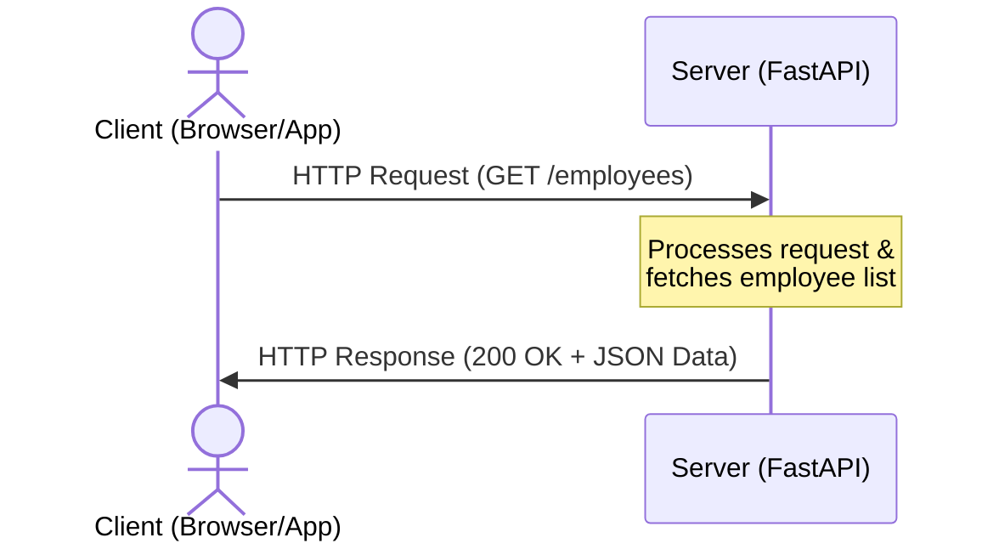
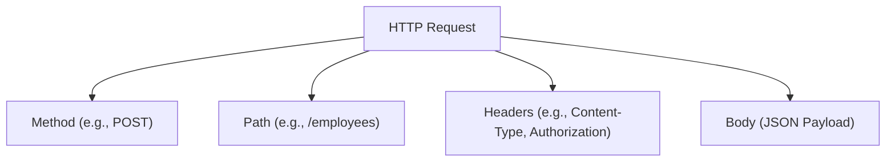
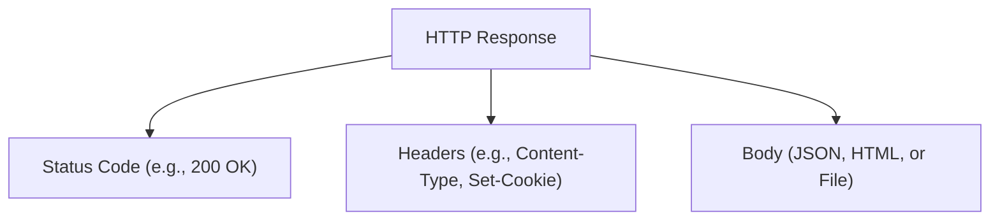

Before building APIs with FastAPI, it is essential to understand how data moves across the internet. Every time you load a webpage, log in to an app, or fetch data, your computer is participating in the **Client-Server Model** over the **HTTP protocol**.

---

## 1. The Client-Server Model

The web runs on a simple pattern of exchange:
* **Client (The Requester)**: Typically a web browser (Chrome, Safari), a mobile app, or a command-line tool like `curl`. The client initiates communication by sending a **Request**.
* **Server (The Responder)**: A computer running software (like our FastAPI application) that listens for incoming requests, processes them (often talking to databases), and sends back a **Response**.

---

## 2. Anatomy of an HTTP Request

An HTTP request is a structured text block sent by the client containing four main components:

1. **HTTP Method (Verb)**: Tells the server what action to perform (e.g., `GET`, `POST`).
2. **URL / Path**: The specific address of the resource (e.g., `/api/v1/employees`).
3. **Headers**: Key-value pairs containing metadata about the request (e.g., `Content-Type: application/json`, auth tokens).
4. **Body (Payload)**: The actual data being sent to the server (e.g., the details of a new employee). Note that `GET` and `DELETE` requests typically do not have bodies.

---

## 3. Anatomy of an HTTP Response

Once the server processes the request, it returns an HTTP response containing:

1. **Status Code**: A three-digit number indicating the outcome of the request (e.g., `200 OK`, `404 Not Found`).
2. **Headers**: Metadata about the response (e.g., `Content-Type: application/json`, server type).
3. **Body**: The requested resource or data (usually formatted as JSON for modern APIs).

---

## 4. HTTP Methods (Verbs)

HTTP methods define the **semantic action** the client wants to perform on a resource. In RESTful API design, we map these methods to CRUD (Create, Read, Update, Delete) operations:

| HTTP Method | CRUD Action | Endpoint Example | Description | Has Body? |
| :--- | :--- | :--- | :--- | :--- |
| **`GET`** | Read | `GET /employees` | Retrieve a list of employees or a specific employee. | No |
| **`POST`** | Create | `POST /employees` | Create a new employee record. | **Yes** |
| **`PUT`** | Update (Full) | `PUT /employees/1` | Completely replace an existing employee record. | **Yes** |
| **`PATCH`** | Update (Partial)| `PATCH /employees/1` | Partially update details (e.g., change department only). | **Yes** |
| **`DELETE`**| Delete | `DELETE /employees/1`| Delete an employee record. | No |

---

## 5. HTTP Status Codes

Status codes are grouped by their first digit to let the client know immediately what kind of outcome occurred:

### 🟢 2xx: Success
* **`200 OK`**: The request succeeded, and the server returned the requested data.
* **`201 Created`**: The request succeeded, and a new resource (e.g., a new employee) was successfully created.

### 🟡 3xx: Redirection
* **`301 Moved Permanently`** / **`307 Temporary Redirect`**: The requested resource is at a different location.

### 🔴 4xx: Client Errors (Your fault)
* **`400 Bad Request`**: The server could not understand the request (e.g., invalid JSON syntax).
* **`401 Unauthorized`**: Authentication is required (e.g., missing or invalid JWT).
* **`403 Forbidden`**: The client is authenticated but does not have permission (e.g., an employee trying to delete another employee's record).
* **`404 Not Found`**: The requested resource does not exist (e.g., employee ID `999` doesn't exist).
* **`422 Unprocessable Entity`**: The request structure is correct, but validation failed (e.g., Pydantic validation error).

### 💥 5xx: Server Errors (My fault)
* **`500 Internal Server Error`**: Something crashed on the server (e.g., unhandled Python exception, database down).
* **`503 Service Unavailable`**: The server is overloaded or down for maintenance.
