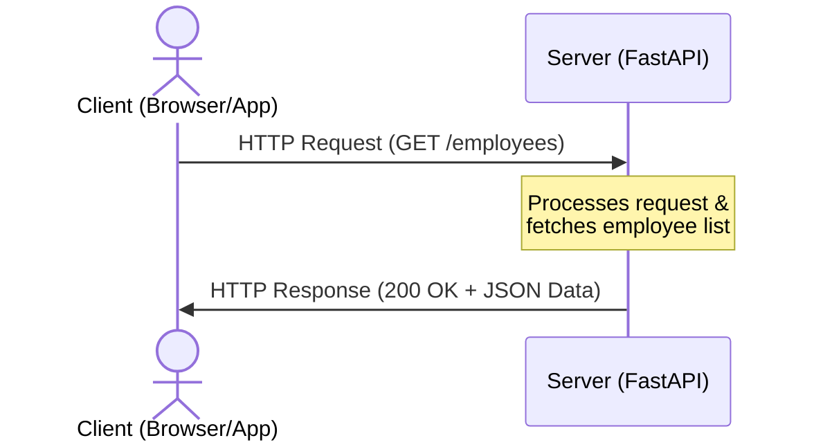

## Build modern backend applications

Python is widely used for backend development, and FastAPI has become one of the most popular frameworks for building modern web APIs. It combines Python's simplicity with high performance, automatic validation, and interactive documentation, making it an excellent choice for developing production-ready backend services.

## How the Web Works

Before building APIs with FastAPI, it is essential to understand how data moves across the internet. Every time you load a webpage, log in to an app, or fetch data, your computer is participating in the **Client-Server Model** over the **HTTP protocol**.


### The Client-Server Model

The web runs on a simple pattern of exchange:
* **Client (The Requester)**: Typically a web browser (Chrome, Safari), a mobile app, or a command-line tool like `curl`. The client initiates communication by sending a **Request**.
* **Server (The Responder)**: A computer running software (like our FastAPI application) that listens for incoming requests, processes them (often talking to databases), and sends back a **Response**.


## HTTP Fundamentals

Communication between clients and servers happens using the **HyperText Transfer Protocol (HTTP)**.

HTTP follows a simple **Request → Response** model.

1. The client sends an HTTP request.
2. The server processes the request.
3. The server returns an HTTP response.

Every interaction with a web application follows this cycle.

### Example HTTP Request

```http
POST /employees/101?active=true HTTP/1.1
Host: api.company.com
Content-Type: application/json
Authorization: Bearer <token>
User-Agent: Mozilla/5.0

{
    "name": "Siva",
    "department": "IT"
}
```

### Request Components

| Component | Example |
|-----------|---------|
| **HTTP Method** | `POST` |
| **Host** | `api.company.com` |
| **Endpoint (Path)** | `/employees/101` |
| **Path Parameter** | `101` |
| **Query Parameter** | `active=true` |
| **Headers** | `Content-Type`, `Authorization`, `User-Agent` |
| **Request Body** | JSON employee data |

### URL Breakdown

For the following URL:

```text
https://api.company.com/employees/101?active=true
```

| Part | Value |
|------|-------|
| **Protocol** | `https` |
| **Host** | `api.company.com` |
| **Endpoint (Path)** | `/employees/101` |
| **Path Parameter** | `101` |
| **Query Parameter** | `active=true` |

> **Note:** The **URL** contains the protocol, host, endpoint (path), path parameters, and query parameters. The complete **HTTP request** additionally includes the HTTP method, headers, cookies, and an optional request body.

## Anatomy of an HTTP Request

An HTTP request typically consists of the following components:

1. **HTTP Method** – Specifies the action to perform on the resource (GET, POST, PUT, DELETE, PATCH, etc.).

2. **Host** – The domain name or IP address of the target server that should handle the request.

3. **Endpoint (Path)** – The specific resource or API route being requested on the server (e.g., `/employees` or `/users/101`).

4. **Path Parameters** – Dynamic values embedded within the endpoint path (e.g., `/employees/101`, where `101` is the path parameter).

5. **Query Parameters** – Optional key-value pairs appended to the URL after `?` to filter, search, sort, or paginate data (e.g., `?department=HR&limit=10`).

6. **Headers** – Metadata about the request, such as content type, authorization token, accepted response format, and user agent.

7. **Cookies** – Client-specific data automatically sent by the browser, often used for sessions and user preferences.

8. **Request Body** – The data sent to the server, typically in JSON format, used with methods like POST, PUT, and PATCH.


## HTTP Methods

| Method | Purpose |
|---------|---------|
| GET | Retrieve data |
| POST | Create new data |
| PUT | Replace existing data |
| PATCH | Update part of existing data |
| DELETE | Remove data |

## API Endpoints

An **endpoint** is a specific URL where an API provides access to a resource.

Examples:

```
GET    /students
GET    /students/101
POST   /students
PUT    /students/101
DELETE /students/101
```

Each endpoint performs a specific operation on a resource.

## Example: HTTP GET Request

Suppose a weather application wants to retrieve the current weather for **London**.

### API URL

This is the complete URL used by the client application.

```text
https://api.weatherapi.com/weather/current?city=London
│       │                  │               │
│       │                  │               └── Query Parameter
│       │                  │
│       │                  └────────────────── Endpoint (Resource)
│       │
│       └───────────────────────────────────── Host (Server)
│
└───────────────────────────────────────────── Protocol
```

- **Protocol** → `https`
- **Host (Server)** → `api.weatherapi.com`
- **Endpoint (Resource)** → `/weather/current`
- **Query Parameter** → `city=London`

> **Note:** In REST APIs, everything exposed by the server is treated as a **resource**. Examples include **students**, **users**, **products**, **orders**, and **weather**. Each resource is identified by its own endpoint.

## Actual HTTP Request

When the client sends the request, it is represented as:

```http
GET /weather/current?city=London HTTP/1.1
Host: api.weatherapi.com
X-API-Key: abc123xyz456
Accept: application/json
```

### Understanding the Request

#### HTTP Method

```text
GET
```

Specifies the action to perform.

- **GET** → Retrieve data
- **POST** → Create data
- **PUT** → Update data
- **DELETE** → Delete data

#### Endpoint

```text
/weather/current
```

Identifies the resource requested from the server.

#### Query Parameter

```text
city=London
```

Provides additional information needed to process the request.

#### Request Headers

```http
Host: api.weatherapi.com
X-API-Key: abc123xyz456
Accept: application/json
```
Headers carry additional information about the request.

- **Host** → Target server
- **X-API-Key** → Client authentication
- **Accept** → Expected response format

> **Note:** The complete URL contains the **protocol** and **host**, but the actual HTTP request sends only the **endpoint** and **query parameters** in the request line. The **host** is sent separately using the **Host** header.

## How to Identify an Endpoint and a Path Parameter from a URL?

A common question is:

> **Given a URL, how can we tell which part is the endpoint and which part is a path parameter?**

<Accordion title="Show Answer">

### Short Answer

**You cannot determine it by looking at the URL alone.**

It depends on **how the route is defined in the application**.


### Example

Consider the following URL:

```text
https://api.company.com/employees/101
```

The path is:

```text
/employees/101
```

Is `101` part of the endpoint or a path parameter?

**We don't know until we see the route definition.**


### Case 1: `101` is a Path Parameter

```python
@app.get("/employees/{employee_id}")
def get_employee(employee_id: int):
    ...
```

Request:

```text
/employees/101
```

FastAPI extracts:

```text
employee_id = 101
```

| Component | Value |
|----------|-------|
| Endpoint Pattern | `/employees/{employee_id}` |
| Requested URL | `/employees/101` |
| Path Parameter | `employee_id = 101` |


### Case 2: `101` is Part of the Endpoint

```python
@app.get("/employees/101")
def get_special_employee():
    ...
```

Here, `101` is a fixed part of the endpoint.

| Component | Value |
|----------|-------|
| Endpoint | `/employees/101` |
| Path Parameter | None |


### Easy Way to Remember

**Route Definition**

```text
/employees/{employee_id}
```

**Actual Request**

```text
/employees/101
```

- `{employee_id}` → Placeholder
- `101` → Actual value


### Key Takeaway

You **cannot identify a path parameter by looking only at the URL**.

You must compare the URL with the **route definition**.

- **Route Definition:** `/employees/{employee_id}`
- **Request URL:** `/employees/101`
- **Path Parameter Value:** `employee_id = 101`

</Accordion>

## HTTP Response

```http
HTTP/1.1 200 OK
Content-Type: application/json

{
    "city": "London",
    "temperature": 18.5,
    "condition": "Partly Cloudy"
}
```

### Response Components

- **Status Line** → `HTTP/1.1 200 OK`
- **Response Headers** → Metadata about the response
- **Response Body** → The actual data returned by the server

## Request–Response Flow

```text
Client
   │
   │ HTTP Request
   ▼
Server
   │
   │ HTTP Response
   ▼
Client
```
> **Note:** Every API communication follows the same cycle:
>
> **Client → HTTP Request → Server → HTTP Response → Client**
## HTTP Status Codes

Status codes are grouped by their first digit to let the client know immediately what kind of outcome occurred:

### 🟢 2xx: Success
* **`200 OK`**: The request succeeded, and the server returned the requested data.
* **`201 Created`**: The request succeeded, and a new resource (e.g., a new employee) was successfully created.

### 🟡 3xx: Redirection
* **`301 Moved Permanently`** / **`307 Temporary Redirect`**: The requested resource is at a different location.

### 🔴 4xx: Client Errors (Your fault)
* **`400 Bad Request`**: The server could not understand the request (e.g., invalid JSON syntax).
* **`401 Unauthorized`**: Authentication is required (e.g., missing or invalid JWT).
* **`403 Forbidden`**: The client is authenticated but does not have permission (e.g., an employee trying to delete another employee's record).
* **`404 Not Found`**: The requested resource does not exist (e.g., employee ID `999` doesn't exist).
* **`422 Unprocessable Entity`**: The request structure is correct, but validation failed (e.g., Pydantic validation error).

### 💥 5xx: Server Errors (My fault)
* **`500 Internal Server Error`**: Something crashed on the server (e.g., unhandled Python exception, database down).
* **`503 Service Unavailable`**: The server is overloaded or down for maintenance.


<CardGroup cols={2}>

<Card
title="Getting Started"
icon="rocket"
href="/fastapi/fundamentals"
>

Install FastAPI, configure your environment, and build your first API.

</Card>

<Card
title="Routing & HTTP Methods"
icon="route"
href="/fastapi/routing"
>

Create API endpoints using GET, POST, PUT, PATCH, and DELETE.

</Card>

<Card
title="Request & Response Models"
icon="cube"
href="/fastapi/request-response-models"
>

Validate incoming data and return structured responses using Pydantic.

</Card>

<Card
title="Interactive API Docs"
icon="book-open"
href="/fastapi/api-documentation"
>

Explore and test your APIs using Swagger UI and ReDoc.

</Card>

</CardGroup>