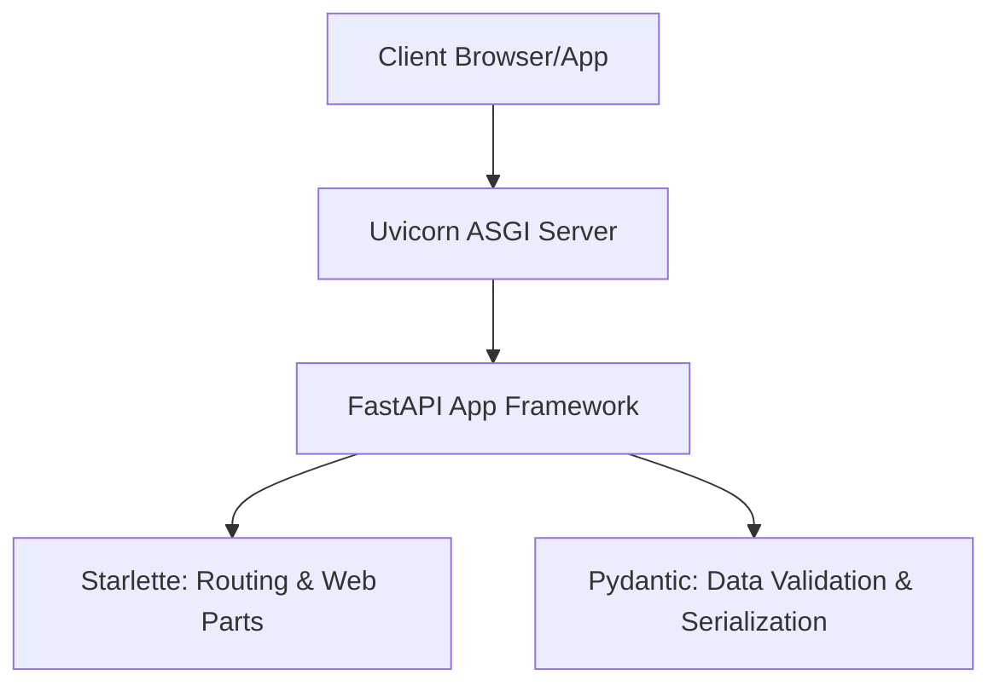

Now that you understand how the web works, let's look at **FastAPI**—one of the most popular, modern, and high-performance Python web frameworks for building APIs.

---

## 1. What is FastAPI?

FastAPI is a modern, fast (high-performance), web framework for building APIs with Python based on standard Python type hints.

### Key Features of FastAPI
* **🚀 High Performance**: Built on top of Starlette and Pydantic, making it one of the fastest Python frameworks available, on par with Node.js and Go.
* **✍️ Faster Coding**: Speeds up feature development by 200% to 300%.
* **🛡️ Fewer Bugs**: Reduces developer-induced errors by about 40% through automatic validation.
* **📖 Auto-Generated Documentation**: Generates interactive documentation pages (Swagger UI and ReDoc) automatically.
* **🔒 Modern & Async**: Native support for asynchronous programming (`async/await`) out of the box.

---

## 2. The Tech Stack Under the Hood

FastAPI stands on the shoulders of giants:



* **Uvicorn**: An ASGI (Asynchronous Server Gateway Interface) web server implementation for Python. It acts as the web server that receives incoming TCP connections from clients and forwards them to FastAPI.
* **Starlette**: A lightweight ASGI framework toolkit. FastAPI inherits all its routing and web handling capabilities from Starlette.
* **Pydantic**: The data validation and serialization library. It enforces types and formats data.

---

## 3. Installation

To get started, we need to install `fastapi` and a production-ready server like `uvicorn`.

Using standard `pip`:
```bash
pip install fastapi uvicorn
```

Or using the ultra-fast package manager `uv`:
```bash
uv pip install fastapi uvicorn
```

---

## 4. Writing Your First App

Let's create a file named `main.py` which will serve as the entrypoint for our **Employee Management System (EMS)** application:

```python
# main.py
from fastapi import FastAPI

# Initialize the FastAPI app
app = FastAPI(
    title="Employee Management System API",
    description="A professional API to manage company employees, departments, and communication.",
    version="1.0.0"
)

# Define a root GET endpoint
@app.get("/")
def read_root():
    return {
        "message": "Welcome to the Employee Management System API!",
        "status": "online"
    }
```

### Explaining the Code
* **`app = FastAPI()`**: Creates the central application object. This object coordinates all routing, middlewares, and startup events.
* **`@app.get("/")`**: A **Path Operation Decorator**. It tells FastAPI that the function directly below it handles requests coming to:
  * The HTTP method: `GET`
  * The path: `/` (the root path)
* **`def read_root()`**: The function that runs when a user hits the endpoint. FastAPI automatically serializes the returned Python dictionary into a JSON response!

---

## 5. Running the Application

To run the application, use the `uvicorn` command in your terminal:

```bash
uvicorn main:app --reload
```

Let's break down this command:
* **`main`**: The name of the Python file (corresponds to `main.py`).
* **`app`**: The variable name of the `FastAPI` instance created inside `main.py`.
* **`--reload`**: Enables **hot-reloading**. The server will automatically restart whenever you save changes to your code. Excellent for development!

Once run, you will see output in the terminal similar to:
```text
INFO:     Uvicorn running on http://127.0.0.1:8000 (Press CTRL+C to quit)
INFO:     Started reloader process [48392] using WatchFiles
INFO:     Started server process [48394]
INFO:     Waiting for application startup.
INFO:     Application startup complete.
```

Open your browser and navigate to `http://127.0.0.1:8000/`. You will see the JSON response:
```json
{
  "message": "Welcome to the Employee Management System API!",
  "status": "online"
}
```
