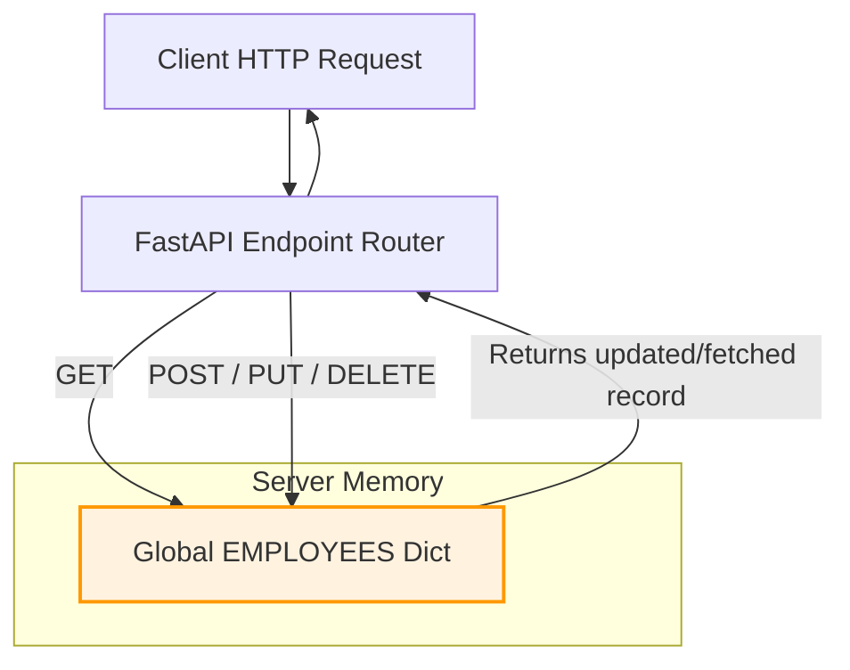

At this stage of the course, we are going to build a working prototype of our **Employee Management System (EMS)** using in-memory data structures (dictionaries and lists) to represent our database. This will help us focus entirely on FastAPI routing, request validation, and response models.

---

## 1. In-Memory Data Flow

Since we are not yet using a database, our application's state lives in the server's RAM. Incoming HTTP requests read from or write to a global Python dictionary.



> [!WARNING]
> Because this state lives in RAM, **restarting the Uvicorn server or modifying your code (triggering a reload) will wipe the memory and reset the data** back to its initial mock state.

---

## 2. Setting Up the Complete CRUD Code

Let's write a complete, standalone file named `ems_app.py` in your project folder to demonstrate a full CRUD API:

```python
# ems_app.py
from fastapi import FastAPI, HTTPException, status, Query
from pydantic import BaseModel, Field

app = FastAPI(
    title="Employee Management System (In-Memory)",
    description="Foundational CRUD API for managing employees.",
    version="1.0.0"
)

# ----------------- PYDANTIC SCHEMAS -----------------

class EmployeeBase(BaseModel):
    name: str = Field(..., min_length=2, max_length=50, examples=["Jane Doe"])
    department: str = Field(..., examples=["Engineering"])
    role: str = Field(..., examples=["Software Engineer"])

class EmployeeCreate(EmployeeBase):
    pass

class EmployeeUpdate(BaseModel):
    name: str | None = Field(None, min_length=2, max_length=50)
    department: str | None = Field(None)
    role: str | None = Field(None)

class EmployeeOut(EmployeeBase):
    id: int

# ----------------- MOCK DATA STATE -----------------

EMPLOYEES: dict[int, dict] = {
    1: {"id": 1, "name": "Alice Smith", "department": "Engineering", "role": "Backend Developer"},
    2: {"id": 2, "name": "Bob Jones", "department": "Product", "role": "Product Manager"}
}

# ----------------- ENDPOINTS (CRUD) -----------------

# 1. READ ALL (Retrieve a list of employees)
@app.get("/employees", response_model=list[EmployeeOut])
def list_employees(
    department: str | None = Query(None, description="Filter employees by department name"),
    skip: int = Query(0, ge=0),
    limit: int = Query(10, ge=1, le=100)
):
    results = list(EMPLOYEES.values())
    
    if department:
        results = [emp for emp in results if emp["department"].lower() == department.lower()]
        
    return results[skip : skip + limit]


# 2. READ ONE (Retrieve a single employee by ID)
@app.get("/employees/{employee_id}", response_model=EmployeeOut)
def get_employee(employee_id: int):
    employee = EMPLOYEES.get(employee_id)
    if not employee:
        raise HTTPException(
            status_code=status.HTTP_404_NOT_FOUND,
            detail=f"Employee with ID {employee_id} not found."
        )
    return employee


# 3. CREATE (Onboard a new employee)
@app.post("/employees", response_model=EmployeeOut, status_code=status.HTTP_201_CREATED)
def create_employee(employee: EmployeeCreate):
    new_id = max(EMPLOYEES.keys()) + 1 if EMPLOYEES else 1
    new_employee = {"id": new_id, **employee.model_dump()}
    EMPLOYEES[new_id] = new_employee
    return new_employee


# 4. UPDATE (Modify details of an existing employee)
@app.put("/employees/{employee_id}", response_model=EmployeeOut)
def update_employee(employee_id: int, employee_update: EmployeeUpdate):
    if employee_id not in EMPLOYEES:
        raise HTTPException(
            status_code=status.HTTP_404_NOT_FOUND,
            detail=f"Employee with ID {employee_id} not found."
        )
    
    stored_employee = EMPLOYEES[employee_id]
    # Update only the fields that were provided in the request
    update_data = employee_update.model_dump(exclude_unset=True)
    
    for key, value in update_data.items():
        stored_employee[key] = value
        
    EMPLOYEES[employee_id] = stored_employee
    return stored_employee


# 5. DELETE (Offboard/Remove an employee)
@app.delete("/employees/{employee_id}", status_code=status.HTTP_204_NO_CONTENT)
def delete_employee(employee_id: int):
    if employee_id not in EMPLOYEES:
        raise HTTPException(
            status_code=status.HTTP_404_NOT_FOUND,
            detail=f"Employee with ID {employee_id} not found."
        )
    del EMPLOYEES[employee_id]
    return # HTTP 204 requires no return body
```

---

## 3. Running and Testing the CRUD Operations

Start the application with Uvicorn:
```bash
uvicorn ems_app:app --reload
```

You can test the endpoints directly using interactive API documentation pages like **Swagger UI** (available at `http://127.0.0.1:8000/docs`). Try:
1. Sending a `POST` request to `/employees` to add a new employee.
2. Sending a `GET` request to `/employees` to verify the new employee is listed.
3. Sending a `PUT` request to `/employees/1` to modify an employee's department.
4. Sending a `DELETE` request to `/employees/2` to remove an employee, verifying you receive a `204 No Content` status.
