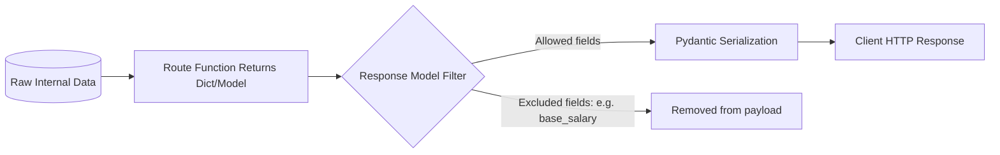

Just as we validate and structure incoming requests, we must also control, sanitize, and format outbound data. FastAPI achieves this using **Response Models** and standard status code responses.

---

## 1. Outbound Data Serialization Flow

When a route function returns data, FastAPI filters the response schema, strips out disallowed properties (like hashed passwords or internal notes), serializes it to JSON, and sets the configured HTTP status code.



---

## 2. Response Models

By declaring a `response_model` in your path operation decorator, you tell FastAPI to:
* **Validate the output**: Ensure the return data complies with the schema.
* **Serialize the data**: Convert complex Python objects (like database models) into JSON.
* **Filter private data**: Exclude fields not explicitly declared in the response model.

### Example: Sanitizing Employee Data
Suppose our internal database contains private fields like `base_salary` and `tax_id` that we do *not* want to share publicly.

```python
from fastapi import FastAPI, status
from pydantic import BaseModel

app = FastAPI()

# 1. Define the input/internal schema
class EmployeeInternal(BaseModel):
    id: int
    name: str
    department: str
    base_salary: float
    tax_id: str

# 2. Define the public output schema (exclude salary & tax_id)
class EmployeePublic(BaseModel):
    id: int
    name: str
    department: str

# Sample Mock Database
EMPLOYEES = {
    1: EmployeeInternal(id=1, name="Alice", department="Engineering", base_salary=8500.0, tax_id="TAX123"),
    2: EmployeeInternal(id=2, name="Bob", department="HR", base_salary=6000.0, tax_id="TAX456")
}

# 3. Use response_model to filter data
@app.get("/employees/{employee_id}", response_model=EmployeePublic)
def get_employee(employee_id: int):
    # Even though we return EmployeeInternal (with salary & tax_id),
    # FastAPI automatically filters the response to match EmployeePublic!
    return EMPLOYEES.get(employee_id)
```

---

## 3. Setting HTTP Status Codes

You can configure the default success status code for a route using the `status_code` parameter in the decorator. It is recommended to use the constants provided in the `status` module for readability.

```python
from fastapi import status

# Onboarding an employee should return 201 Created
@app.post("/employees", response_model=EmployeePublic, status_code=status.HTTP_201_CREATED)
def create_employee(employee: EmployeePublic):
    return employee
```

---

## 4. Raising HTTP Exceptions

When a request goes wrong (e.g., resource not found, invalid permissions), you should interrupt the flow immediately by raising an `HTTPException`.

```python
from fastapi import HTTPException

@app.get("/employees/{employee_id}", response_model=EmployeePublic)
def get_employee(employee_id: int):
    employee = EMPLOYEES.get(employee_id)
    
    if not employee:
        # Halt execution and return a 404 response to the client
        raise HTTPException(
            status_code=status.HTTP_404_NOT_FOUND,
            detail=f"Employee with ID {employee_id} does not exist"
        )
        
    return employee
```

---

## 5. Custom Responses

Sometimes you need to return something other than standard JSON—for example, HTML pages, static text, redirect headers, or files (like downloading an employee report PDF).

You can return a custom `Response` directly:

```python
from fastapi.responses import HTMLResponse, FileResponse

@app.get("/welcome", response_class=HTMLResponse)
def welcome_page():
    return """
    <html>
        <body>
            <h1>Employee Onboarding Dashboard</h1>
            <p>Welcome to the company portal!</p>
        </body>
    </html>
    """
```
