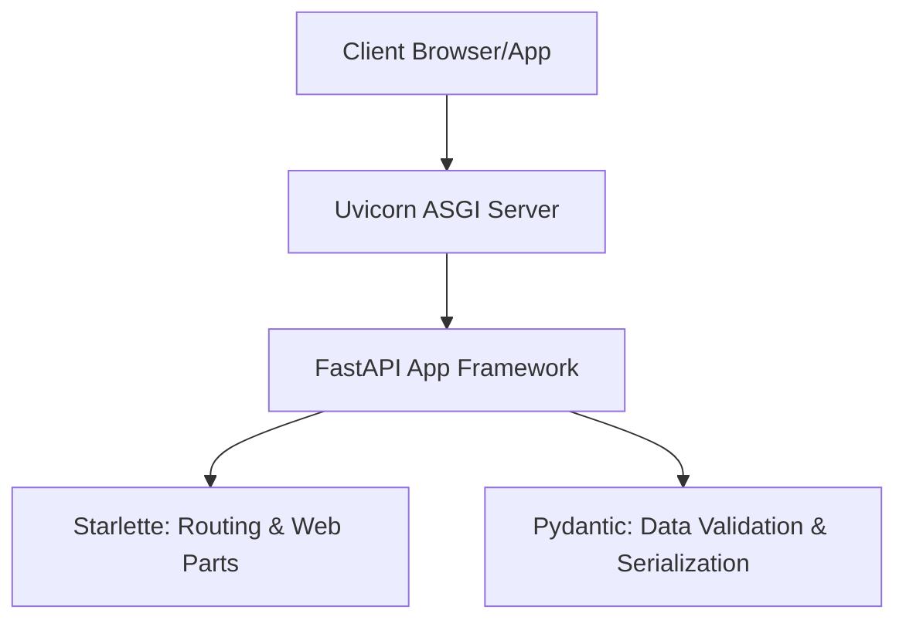

##  What is FastAPI?

FastAPI is a modern, high-performance Python framework for building REST APIs. It uses Python type hints, provides automatic validation, and generates interactive API documentation out of the box.

### Key Features of FastAPI
* **🚀 High Performance**: Built on top of Starlette and Pydantic, making it one of the fastest Python frameworks available, on par with Node.js and Go.
* **✍️ Faster Coding**: Speeds up feature development by 200% to 300%.
* **🛡️ Fewer Bugs**: Reduces developer-induced errors by about 40% through automatic validation.
* **📖 Auto-Generated Documentation**: Generates interactive documentation pages (Swagger UI and ReDoc) automatically.
* **🔒 Modern & Async**: Native support for asynchronous programming (`async/await`) out of the box.


## The Tech Stack Under the Hood

FastAPI stands on the shoulders of giants:



* **Uvicorn**: An ASGI (Asynchronous Server Gateway Interface) web server implementation for Python. It acts as the web server that receives incoming TCP connections from clients and forwards them to FastAPI.
* **Starlette**: A lightweight ASGI framework toolkit. FastAPI inherits all its routing and web handling capabilities from Starlette.
* **Pydantic**: The data validation and serialization library. It enforces types and formats data.


## Learning Objectives in this chapter..

After completing this chapter, you will be able to:

- Install and configure FastAPI
- Create and run your first API
- Understand routing and HTTP methods
- Work with path and query parameters
- Accept request data using Pydantic models
- Return structured responses
- Validate request data
- Use HTTP status codes
- Explore the generated API documentation

## Prerequisites

- Python 3.10 or later
- pip or uv
- Virtual Environment (recommended)
- VS Code or any Python IDE

## Creating a Virtual Environment

```bash
python -m venv .venv
```

Activate the environment.

**Windows**

```bash
.venv\Scripts\activate
```

**macOS / Linux**

```bash
source .venv/bin/activate
```

## Installing FastAPI

```bash
pip install fastapi
pip install "uvicorn[standard]"
```

Verify the installation.

```bash
pip show fastapi
pip show uvicorn
```

## Your First FastAPI Application

Create a file named **`main.py`**.

```python
from fastapi import FastAPI

app = FastAPI()

@app.get("/")
def home():
    return {"message": "Welcome to FastAPI"}
```
## Understanding the First FastAPI Program
Unlike traditional Python programs, a FastAPI application is **not a program that runs from top to bottom and immediately produces an output**.

Instead, we **configure** the FastAPI server by telling it:

- What application to create
- Which URLs it should respond to
- Which function should execute for each URL

When a client (such as a browser or Postman) sends a request, the FastAPI server uses this configuration to determine which function to execute.

### Key Points

#### 1. Import the FastAPI Class

```python
from fastapi import FastAPI
```

Imports the **FastAPI** class, which is used to create a FastAPI application.


#### 2. Create the Application

```python
app = FastAPI()
```

Creates the FastAPI application object.

The `app` object stores:

- API endpoints
- Application configuration
- Middleware
- Dependencies
- API documentation

> **Note:** This does **not** start the server. It only creates and configures the application.


#### 3. Register an Endpoint

```python
@app.get("/")
```

Registers a **GET** endpoint for the root URL (`/`).

It tells FastAPI:

> "If a GET request is received for `/`, execute the function below."


#### 4. Define the Request Handler

```python
def home():
```

This is a normal Python function.

Unlike traditional Python programs, **you do not call this function yourself**. FastAPI automatically calls it when a matching request arrives.

#### 5. Return the Response

```python
return {"message": "Welcome to FastAPI"}
```

Returns a Python dictionary.

FastAPI automatically converts it into a JSON response.

Client receives:

```json
{
    "message": "Welcome to FastAPI"
}
```


#### 6. JSON is the Default Response Format

FastAPI automatically converts Python objects such as:

- Dictionaries
- Lists
- Pydantic models

into **JSON** before sending them to the client.

You do **not** need to manually convert them into JSON.


## Traditional Python vs FastAPI

### Traditional Python

- Program executes from top to bottom.
- Functions are called explicitly by the programmer.
- Program ends after execution.

```python
def greet():
    print("Hello")

greet()
```


### FastAPI

- You configure the application.
- Register API endpoints.
- Start the server.
- FastAPI waits for incoming requests.
- FastAPI automatically calls the appropriate function when a request arrives.


## Execution Flow

```text
Start Application
        │
        ▼
Create FastAPI App
        │
        ▼
Register Endpoints
        │
        ▼
Start FastAPI Server
        │
        ▼
Wait for Client Requests
        │
        ▼
Request Received
        │
        ▼
Find Matching Endpoint
        │
        ▼
Execute Function
        │
        ▼
Convert Response to JSON
        │
        ▼
Send Response to Client
```

## Key Takeaways

- `FastAPI()` creates the web application.
- `@app.get("/")` registers an endpoint.
- Functions are executed **automatically** by FastAPI.
- Most FastAPI code is **configuration**, not direct execution.
- By default, FastAPI returns responses in **JSON** format.
- FastAPI handles request routing and response generation automatically.

## Running the Application

```bash
uvicorn main:app --reload
```

Common options:

```bash
uvicorn main:app --reload --host 0.0.0.0 --port 8000
```

**Command Breakdown**

- `main` → Python file (`main.py`)
- `app` → FastAPI application object
- `--reload` → Restart server on code changes
- `--host` → Host address
- `--port` → Server port

## Accessing the Application

| URL | Purpose |
|------|---------|
| `http://127.0.0.1:8000` | Application |
| `http://127.0.0.1:8000/docs` | Swagger UI |
| `http://127.0.0.1:8000/redoc` | ReDoc |
| `http://127.0.0.1:8000/openapi.json` | OpenAPI Specification |

## Routing

A **route** maps an API endpoint to a Python function.

```python
@app.<http_method>("endpoint")
def function_name():
    ...
```

Example:

```python
@app.get("/students")
def get_students():
    return {"message": "Getting all students"}
```

Request flow:

```
Request → Route → Function → Response
```

## Common conventions for designing clean and consistent REST APIs

### General Guidelines

- Use **nouns** for resources, not verbs.
- Use **plural** resource names.
- Keep URLs **lowercase**.
- Use **hyphens (`-`)** instead of underscores (`_`).
- Keep URLs short and meaningful.

### Good Examples

```text
/students
/students/101
/student-courses
```

### Bad Examples

```text
/getStudents
/createStudent
/studentDetails
/get_student
```


## HTTP Methods

| Method | Purpose | Example |
|---------|----------|---------|
| GET | Retrieve data | `GET /students` |
| POST | Create a resource | `POST /students` |
| PUT | Replace an existing resource | `PUT /students/101` |
| PATCH | Partially update a resource | `PATCH /students/101` |
| DELETE | Remove a resource | `DELETE /students/101` |


## Path Variables

Use **path variables** when identifying a **specific resource**.

### Good Examples

```http
GET /students/101
PUT /students/101
DELETE /students/101
GET /students/101/courses
```

### Bad Examples

```http
GET /students?id=101
DELETE /deleteStudent?id=101
```

> **Rule:** If the value uniquely identifies a resource, use a **path variable**.


## Query Parameters

Use **query parameters** for **optional operations**, such as:

- Filtering
- Searching
- Sorting
- Pagination

### Good Examples

```http
GET /students?department=CSE
GET /students?name=John
GET /students?sort=name
GET /students?page=1&limit=10
```

### Bad Examples

```http
GET /students/CSE
GET /students/page/1
GET /students/sort/name
```

> **Rule:** If the parameter changes **how data is retrieved** rather than **which resource is retrieved**, use a **query parameter**.


## Request Body

Use the request body with **POST**, **PUT**, and **PATCH** requests.

```json
{
    "name": "John",
    "age": 21,
    "department": "CSE"
}
```

## Student API Example

```text
GET    /students
GET    /students/101
GET    /students?department=CSE
GET    /students?name=John
GET    /students?page=1&limit=10

POST   /students
PUT    /students/101
PATCH  /students/101
DELETE /students/101
```

## Quick Rules

| Use | Example |
|------|---------|
| **Path Variable** | `/students/101` (identifies a specific resource) |
| **Query Parameter** | `/students?department=CSE` (filters or modifies the result) |
| **Request Body** | `POST /students` (sends resource data) |

### Common Routes

```python
@app.get("/students")
def get_students():
    return {"message": "Getting all students"}
```

```python
@app.post("/students")
def create_student():
    return {"message": "Student created"}
```

```python
@app.put("/students/{student_id}")
def update_student(student_id: int):
    return {"message": f"Updating student {student_id}"}
```

```python
@app.delete("/students/{student_id}")
def delete_student(student_id: int):
    return {"message": f"Deleting student {student_id}"}
```

> A route simply connects an API endpoint to a Python function.

## Path Parameters

Path parameters are part of the URL and identify a specific resource.

```python
@app.get("/students/{student_id}")
def get_student(student_id: int):
    return {"student_id": student_id}
```

Request:

```http
GET /students/101
```

Examples:

```text
/students/101
/products/25
/orders/5001
```

## Query Parameters

Query parameters appear after the `?` in the URL.

```python
@app.get("/students")
def get_students(course: str, semester: int):
    return {
        "course": course,
        "semester": semester
    }
```

Request:

```http
GET /students?course=CSE&semester=4
```

Common uses:

- Searching
- Filtering
- Sorting
- Pagination

## Request Body

Use a Pydantic model to receive JSON data.

```python
from pydantic import BaseModel

class Student(BaseModel):
    name: str
    age: int
    course: str
```

```python
@app.post("/students")
def create_student(student: Student):
    return student
```

Request body:

```json
{
    "name": "Rahul",
    "age": 20,
    "course": "CSE"
}
```

## Response Models

Define the response structure using `response_model`.

```python
from pydantic import BaseModel

class StudentResponse(BaseModel):
    id: int
    name: str
    age: int
    course: str
```

```python
@app.post("/students", response_model=StudentResponse)
def create_student(student: Student):
    return {
        "id": 101,
        **student.model_dump()
    }
```

## Status Codes

```python
from fastapi import status

@app.post("/students", status_code=status.HTTP_201_CREATED)
def create_student(student: Student):
    return student
```

| Code | Meaning |
|------|---------|
| 200 | OK |
| 201 | Created |
| 204 | No Content |
| 400 | Bad Request |
| 401 | Unauthorized |
| 403 | Forbidden |
| 404 | Not Found |
| 422 | Validation Error |
| 500 | Internal Server Error |

## Request Validation

FastAPI automatically validates incoming data.

```python
from pydantic import BaseModel, Field

class Student(BaseModel):
    name: str
    age: int = Field(gt=0)
    course: str
```

Invalid request:

```json
{
    "name": "Rahul",
    "age": -5,
    "course": "CSE"
}
```

If validation fails, FastAPI returns a **422 Validation Error** without executing the route.

## Data Validation can be applied to:

- **Request Body** using `Field()`
- **Query Parameters** using `Query()`
- **Path Parameters** using `Path()`

In **Pydantic v2**, the recommended way to specify validations is using Python's `Annotated` type.

### What is `Annotated`?

`Annotated` lets you combine a **data type** with **validation metadata**.

**Syntax**

```python
Annotated[type, validation]
```

For example:

```python
from typing import Annotated
from pydantic import Field

age: Annotated[int, Field(gt=0, lt=100)]
```

Here:

- `int` specifies the expected data type.
- `Field(gt=0, lt=100)` specifies the validation rules.

The equivalent (older) syntax is:

```python
age: int = Field(gt=0, lt=100)
```

Both styles work, but **`Annotated` is the recommended approach** in FastAPI and Pydantic v2.

### 1. `Field()` – Request Body Validation

`Field()` is used inside **Pydantic models** to validate request body fields.

**Recommended**

```python
from typing import Annotated
from pydantic import BaseModel, EmailStr, Field

class Student(BaseModel):
    name: Annotated[str, Field(min_length=3, max_length=50)]
    age: Annotated[int, Field(gt=0, lt=100)]
    email: EmailStr
    cgpa: Annotated[float, Field(ge=0, le=10)]
```

**Alternative**

```python
class Student(BaseModel):
    name: str = Field(min_length=3, max_length=50)
    age: int = Field(gt=0, lt=100)
    email: EmailStr
    cgpa: float = Field(ge=0, le=10)
```

### 2.`Query()` – Query Parameter Validation

`Query()` validates values passed as query parameters.

Example request:

```http
GET /students?page=1&limit=20&dept=CSE
```

**Recommended**

```python
from typing import Annotated
from fastapi import Query

@app.get("/students")
def get_students(
    page: Annotated[int, Query(ge=1)] = 1,
    limit: Annotated[int, Query(ge=1, le=100)] = 20,
    department: Annotated[str | None, Query(alias="dept")] = None,
):
    ...
```

**Alternative**

```python
@app.get("/students")
def get_students(
    page: int = Query(default=1, ge=1),
    limit: int = Query(default=20, ge=1, le=100),
    department: str | None = Query(default=None, alias="dept"),
):
    ...
```

### 3. `Path()` – Path Parameter Validation

`Path()` validates values passed as path parameters.

Example request:

```http
GET /students/101
```

**Recommended**

```python
from typing import Annotated
from fastapi import Path

@app.get("/students/{student_id}")
def get_student(
    student_id: Annotated[int, Path(gt=0)]
):
    ...
```

**Alternative**

```python
@app.get("/students/{student_id}")
def get_student(
    student_id: int = Path(gt=0)
):
    ...
```
### Common Validation Options

| Option | Purpose |
|---------|---------|
| `gt` | Greater than |
| `ge` | Greater than or equal |
| `lt` | Less than |
| `le` | Less than or equal |
| `min_length` | Minimum string length |
| `max_length` | Maximum string length |
| `pattern` | Regular expression |
| `default` | Default value |
| `alias` | Alternate field/parameter name |
| `title` | Display title in API docs |
| `description` | Description in API docs |
| `examples` | Example values |

### Common Pydantic Types

| Type | Purpose |
|------|---------|
| `EmailStr` | Validates email addresses |
| `AnyUrl` | Validates URLs |
| `UUID` | Validates UUID values |
| `date` | Date |
| `datetime` | Date and time |
| `Decimal` | High-precision decimal |

Example:

```python
from pydantic import BaseModel, EmailStr

class Student(BaseModel):
    email: EmailStr
```

If an invalid email is provided, FastAPI automatically returns a **422 Unprocessable Entity** response.

> **Note:** `EmailStr` requires the `email-validator` package.

```bash
pip install email-validator
```

## Automatic API Documentation

| URL | Purpose |
|------|---------|
| `http://localhost:8000/docs` | Swagger UI |
| `http://localhost:8000/redoc` | ReDoc |
| `http://localhost:8000/openapi.json` | OpenAPI JSON |

## Quick Commands

| Conventional (`pip`) | Modern (`uv`) |
|----------------------|---------------|
| `pip install fastapi` | `uv add fastapi` |
| `pip install "uvicorn[standard]"` | `uv add "uvicorn[standard]"` |
| `uvicorn main:app --reload` | `uv run uvicorn main:app --reload` |
| `uvicorn main:app --reload --port 8001` | `uv run uvicorn main:app --reload --port 8001` |
| `uvicorn main:app --reload --host 0.0.0.0` | `uv run uvicorn main:app --reload --host 0.0.0.0` |
| `pip freeze > requirements.txt` | `uv export --format requirements-txt -o requirements.txt` |
| `pip install -r requirements.txt` | `uv pip install -r requirements.txt` *(or `uv sync`)* |

## Summary

In this chapter, you learned how to:

- Install FastAPI
- Create and run a FastAPI application
- Define routes
- Work with path and query parameters
- Accept request bodies
- Return response models
- Validate request data
- Use HTTP status codes
- Explore the generated API documentation