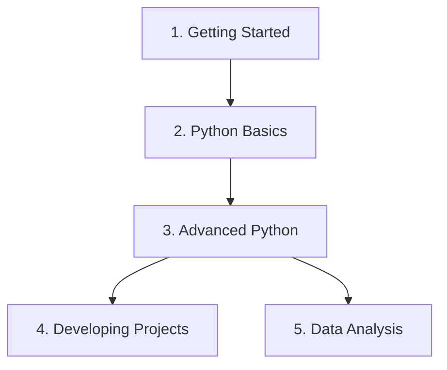

Welcome to the **Python for AI Beginner Course Route Map**. Use this interactive directory to navigate the entire syllabus. Click on any topic or sub-topic below to go directly to its learning material.

---

## 🗺️ Course Syllabus Overview

---

## [Module 1: Getting Started](/getting-started/index)

Setting up your environment, editor workspaces, and learning to manage packages and virtual environments safely.

### 1.1 Python Setup & Platform Guides
* **[What is Python?](/getting-started/what-is-python)**
  * Dynamic Typing vs. Static Typing
  * Python Interpreter & Runtime Engine
* **[Installing Python](/getting-started/installing-python)**
  * [Windows Installation Guide](/getting-started/installing-python-windows)
  * [macOS Installation Guide](/getting-started/installing-python-macos)
  * [Linux Installation Guide](/getting-started/installing-python-linux)

### 1.2 Code Editor & Workspaces
* **[VS Code Introduction & Setup](/getting-started/installing-python)**
  * Installing extension bundles (Python, Pylance, Jupyter)
  * Virtual folder architectures & writing your first `.py` file

### 1.3 Python Environments
* **[Virtual Environments](/getting-started/installing-python)**
  * Creating environments (`python -m venv .venv` and `uv venv`)
  * Activation mechanics across shells (Bash, zsh, PowerShell)
* **[Packages & pip](/getting-started/installing-python)**
  * Installing packages from PyPI
* **[Interactive Python](/getting-started/installing-python)**
  * REPL interface & Jupyter Notebooks (`.ipynb`) setup

---

## [Module 2: Python Basics](/basics/index)

Laying down the core procedural and object-oriented foundations of Python.

### 2.1 Basic Core Syntax
* **[Introduction to Programming](/basics/intro-to-programming)**
  * Flowcharts & algorithmic structures
* **[Python Syntax](/basics/python-syntax)**
  * Block indentation limits & statements
* **[Python Errors](/basics/python-errors)**
  * Syntax vs. Runtime exceptions
* **[Code Formatting](/basics/formatting)**
  * PEP 8 styling rules & auto-formatters (Black, Ruff)
* **[Variables](/basics/variables)**
  * Declaration, dynamic typing, and memory assignment
* **[Comments](/basics/comments)**
  * Single-line (`#`), Multi-line, and docstrings (`"""`)

### 2.2 Operators & Data Types
* **[Operators](/basics/operators)**
  * Arithmetic, Comparison, Logical, Assignment, Membership, and Identity operators
* **[Core Data Types](/basics/data-types)**
  * Scalar types: Integers, Floats, Strings, Booleans
* **[Number Manipulation](/basics/number-manipulation)**
  * Type Casting & basic math built-in utilities (`round()`, `abs()`)
* **[String Manipulation](/basics/string-manipulation)**
  * Slicing indexes (`[start:stop:step]`), string methods, and f-strings

### 2.3 Control Flow & Data Structures
* **[Conditionals](/basics/conditionals)**
  * If-elif-else statements & indentation scoping
* **[Match Case](/basics/match-case)**
  * Pattern Matching, wildcards (`_`), and guard conditions
* **[Loops & Loop Control](/basics/loops)**
  * `for` loops (iterables, `range()`) and `while` loops
  * [Loop control statements](/basics/loop-control): `break`, `continue`, `pass`
* **[Lists](/basics/lists)**
  * Ordered arrays: indexing, slicing, mutation, and list methods
* **[Tuples](/basics/tuples)**
  * Immutable sequences & packing/unpacking signatures
* **[Dictionaries](/basics/dictionaries)**
  * Key-value hashing maps & dictionary methods
* **[Sets](/basics/sets)**
  * Unordered collections of unique values & set operations
* **[Queues](/basics/queues)**
  * Double-ended queues (`collections.deque`) & FIFO operations
* **[Packing & Unpacking](/basics/packing-unpacking)**
  * Positional star args (`*args`) & keyword double-star args (`**kwargs`)

### 2.4 Structural Foundations
* **[Functions](/basics/functions)**
  * Defining reusable blocks, parameters, return values, and variable scope
* **[Modules & Packages](/basics/modules-packages)**
  * Custom module files & `__init__.py` bindings
* **[Classes & OOP](/basics/classes)**
  * Blueprint class schemas, instance creation, self bindings, and attributes
* **[Error & Exception Handling](/basics/error-handling)**
  * Try-except-finally blocks & custom exception classes

---

## Advanced Python

Deep-diving into language internals, functional styles, dynamic type checking, and external API services.

### 3.1 Advanced Concepts
* **[Python Internals](/advanced-python/internals)**
  * CPython memory management, reference counting, and garbage collection
* **[Advanced Functions](/advanced-python/functions)**
  * First-class objects, closures, and decorators (`@decorator`)
* **[Comprehensions](/advanced-python/comprehensions)**
  * List, Dictionary, and Set comprehensions, and generator expressions
* **[Functional Programming](/advanced-python/functional-programming)**
  * Declarative vs. Imperative programming, and `map()`, `filter()`, `reduce()`
* **[Advanced OOP](/advanced-python/advanced-oop)**
  * Abstract Base Classes (ABC), `@abstractmethod`, and dunder methods
* **[Pydantic & Data Validation](/advanced-python/pydantic/introduction)**
  * Type Hints, Dataclasses, BaseModel schemas, constraints, custom field validators, nested models, and Pydantic Settings

### 3.2 Extending Python & Libraries
* **[Working with Built-in Modules](/libraries-apis/importing-modules)**
  * `math`, `random`, `datetime` (formatting and parsing), and `os` audits
* **[Working with Data](/libraries-apis/working-with-data)**
  * Text files, JSON loading/dumping, and CSV file reading/writing
* **[Working with External Modules](/libraries-apis/external-modules)**
  * PyPI library repository, package installs with `pip`/`uv`, and `requirements.txt`
* **[Working with APIs](/libraries-apis/working-with-apis)**
  * HTTP GET requests, parsing payloads, and calling Open-Meteo weather API
* **[Working with Environment Variables](/libraries-apis/working-with-env)**
  * Secure API key storage, `.env` files, `.gitignore`, and `dotenv` reloads

---

## [Module 4: Developing Projects](/practical-python/index)

Structuring production-grade applications, managing package paths, and organizing modules.

### 4.1 Project Architecture
* **[Project Structure](/practical-python/project-structure)**
  * Standard project folder setups (`src/`, `tests/`, `configs/`)
* **[Python Paths](/practical-python/python-paths)**
  * Environment sys path boundaries & import resolutions
* **[Working with Files](/practical-python/working-with-files)**
  * Interacting with project asset directories
* **[Organizing Code](/practical-python/organizing-code)**
  * Refactoring complex scripts into reusable files

---

## [Module 5: Streamlit Fundamentals](/streamlit/intro)

Creating interactive web applications, dashboards, and data interfaces in pure Python.

* **[Introduction to Streamlit](/streamlit/intro)**: App architecture and Tornado web servers.
* **[Application Structure](/streamlit/structure)**: The script rerun execution model.
* **[Displaying Content](/streamlit/displaying-content)**: Text, markdown, dataframes, and charts.
* **[User Input Widgets](/streamlit/widgets)**: Buttons, inputs, sliders, and uploaders.
* **[Layout Management](/streamlit/layout)**: Sidebars, columns, expanders, and tabs.
* **[Session State](/streamlit/session-state)**: Persisting variables across top-to-bottom runs.
* **[Forms](/streamlit/forms)**: Grouping inputs to prevent premature reruns.
* **[Data Handling](/streamlit/data-handling)**: Reading and uploading CSV and JSON datasets.
* **[Caching](/streamlit/caching)**: Speeding up apps using @st.cache decorators.
* **[Navigation & Multipage Apps](/streamlit/navigation)**: Multi-page structures and shared sidebars.
* **[Working with APIs](/streamlit/apis)**: Fetching REST API data and showing spinners.
* **[Building Interactive Dashboards](/streamlit/dashboards)**: KPIs, charts, filters, and dynamic tables.
* **[File Handling](/streamlit/files)**: Upload/download utilities and media previews.
* **[Deployment](/streamlit/deployment)**: Community Cloud, Docker, and Render hosting.

---

## [Module 6: Data Analysis](/data-analysis/numpy)

Building the mathematical and data manipulation foundations needed for Machine Learning and AI.

### 6.1 NumPy
* **[NumPy Arrays](/data-analysis/numpy)**
  * Creating NDArrays, slicing, indexing, vectorization, and broadcasting

### 6.2 Pandas
* **[Pandas DataFrames](/data-analysis/pandas)**
  * Data Wrangling, handling missing values, cleaning, merging, and aggregating

### 6.3 Data Visualization
* **[Matplotlib](/data-analysis/matplotlib)**
  * Plotting lines, scatter plots, bar charts, custom axes, and subplots
* **[Seaborn](/data-analysis/seaborn)**
  * Statistical plots, heatmaps, joint/pair distributions, and styling guides
* **[Visualization Guide](/data-analysis/visualization-guide)**
  * Comprehensive review of end-to-end dataset plotting pipelines
