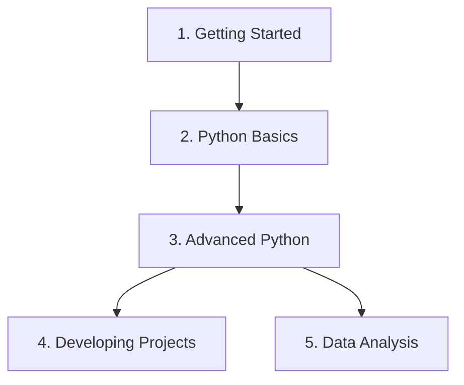

# Course Brochure: Python for AI Beginner Course

Welcome to the **Python for AI Beginner Course**. This syllabus is structured to take you from a absolute beginner to confidently building Generative AI applications and analyzing dataset configurations using industry-standard tools (VS Code, pip, uv, Pydantic, NumPy, Pandas).

---

## 🗺️ Course Syllabus Overview

---

## Module 1: Getting Started

Setting up your environment, editor workspaces, and learning to manage packages and virtual environments safely.

### 1.1 Python Setup & Platform Guides
* **What is Python?**
  * Dynamic Typing vs. Static Typing
  * Python Interpreter & Runtime Engine
* **Installing Python**
  * Windows installation guides & environment PATH configurations
  * macOS installation (using Homebrew & installer packages)
  * Linux installation (apt package management)

### 1.2 Code Editor & Workspaces
* **VS Code Introduction & Setup**
  * Installing extension bundles (Python, Pylance, Jupyter)
* **Managing Workspaces**
  * Virtual folder architectures
  * Writing your first `.py` source file & terminal execution

### 1.3 Python Environments
* **Virtual Environments**
  * Creating environments (`python -m venv .venv` and `uv venv`)
  * Activation mechanics across shell scripts (Bash, zsh, PowerShell)
* **Packages & pip**
  * Installing packages from PyPI
  * Standard package listing with `pip list`
* **Interactive Python**
  * REPL interface
  * Jupyter Notebooks (`.ipynb`) setup and running cells

---

## Module 2: Python Basics

Laying down the core procedural and object-oriented foundations of Python.

### 2.1 Basic Core Syntax
* **Introduction to Programming**
  * Flowcharts & algorithmic structures
* **Python Syntax**
  * Block indentation limits & statements
* **Python Errors**
  * Syntax vs. Runtime exceptions
* **Code Formatting**
  * PEP 8 styling rules & auto-formatters (Black, Ruff)
* **Variables**
  * Declaration, dynamic typing, and memory assignment
  * Strict variable naming rules
* **Comments**
  * Single-line (`#`) & Multi-line strings
  * Documenting code using docstrings (`"""`)

### 2.2 Operators & Data Types
* **Operators**
  * Arithmetic (`+`, `-`, `*`, `/`, `//`, `%`, `**`)
  * Comparison (`==`, `!=`, `>`, `<`, `>=`, `<=`)
  * Logical (`and`, `or`, `not`)
  * Assignment (`+=`, `-=`, etc.)
  * Membership (`in`, `not in`) & Identity (`is`, `is not`)
* **Core Data Types**
  * Scalar types: Integers, Floats, Strings, Booleans
* **Number Manipulation**
  * Type Casting (`int()`, `float()`, `str()`)
  * Basic math built-in utilities (`round()`, `abs()`)
* **String Manipulation**
  * Slicing indexes (`[start:stop:step]`)
  * String concatenation & built-in methods (`.upper()`, `.lower()`, `.strip()`, `.replace()`)
  * Dynamic string formatting (f-strings)

### 2.3 Control Flow & Data Structures
* **Conditionals**
  * If-elif-else statements & indentation scoping
* **Match Case**
  * Structural Pattern Matching (introduced in Python 3.10)
  * Wildcards (`_`) & guard conditions
* **Loops & Loop Control**
  * `for` loops (iterables, `range()`)
  * `while` loops (conditional iterations)
  * Loop control statements: `break`, `continue`, `pass`
* **Lists**
  * Ordered arrays: indexing, slicing, and mutation
  * Methods: `.append()`, `.extend()`, `.insert()`, `.remove()`, `.pop()`
* **Tuples**
  * Immutable sequences & packing/unpacking signatures
* **Dictionaries**
  * Key-value hashing maps
  * Dictionary methods (`.get()`, `.keys()`, `.values()`, `.items()`)
* **Sets**
  * Unordered collections of unique values
  * Set math operations: Union (`|`), Intersection (`&`), Difference (`-`)
* **Queues**
  * Double-ended queues (`collections.deque`)
  * FIFO (First-In, First-Out) operations (`.append()`, `.popleft()`)
* **Packing & Unpacking**
  * Positional star args (`*args`) & keyword double-star args (`**kwargs`)

### 2.4 Structural Foundations
* **Functions**
  * Defining reusable blocks using `def`
  * Positional vs. Keyword arguments, default parameters
  * Variable scope rules (Local vs. Global)
* **Modules & Packages**
  * Custom module files & `__init__.py` directory package bindings
  * Import patterns & namespaces
* **Classes & Object-Oriented Programming (OOP)**
  * Blueprint class schemas, instance creation, and self bindings
  * Class attributes vs. Instance attributes
* **Error & Exception Handling**
  * Try-except-finally blocks
  * Custom exception classes (inheriting `Exception`)

---

## Module 3: Advanced Python

Deep-diving into language internals, functional styles, dynamic type checking, and external API services.

### 3.1 Advanced Concepts
* **Python Internals**
  * CPython memory management model
  * Reference counting & garbage collection algorithms
  * Memory profiling & variable lookup tables
* **Advanced Functions**
  * First-class objects (passing functions as arguments/variables)
  * Closures (nested functions maintaining scope references)
  * Decorators (modifying behaviors using `@decorator` wrappers)
* **Comprehensions**
  * List, Dictionary, and Set comprehensions
  * Generator expressions for memory efficiency
* **Functional Programming**
  * Declarative vs. Imperative programming
  * Built-in helpers: `map()`, `filter()`, and `reduce()`
  * Chained pipelines & list comprehension equivalents
* **Advanced OOP**
  * Abstract Base Classes (ABC) & `@abstractmethod` contracts
  * Class construction stages (metaclasses & dynamic creation)
  * Dunder (Magic) methods (`__new__`, `__init__`, `__call__`, `__repr__`)
* **Data Validation & Type Hints**
  * Basic & Complex type annotations (`list[float]`, `dict[str, str]`, union `|`, optional `| None`)
  * Dataclasses (cleaner templates, default values, collections properties)
* **Pydantic**
  * Declarative BaseModel schemas & runtime type coercion
  * Constraints (`Field`) & custom field validators (`@field_validator`)
  * Nested models validation & JSON serialization (`.model_dump()`, `.model_dump_json()`)

### 3.2 Extending Python & Libraries
* **Working with Built-in Modules**
  * `math` constants & roundings
  * `random` float/randint/shuffles
  * `datetime` timing arithmetic, strftime formatting, and strptime parsing
  * `os` directory audits and path building (`os.path.join`)
* **Working with Data**
  * Text files (`open()` reading/writing/line-by-line loops)
  * JSON reading and writing (`json.load`/`json.dump`)
  * CSV spreadsheet reading & writing (`csv.reader`, `csv.DictReader`, `csv.DictWriter`)
* **Working with External Modules**
  * PyPI library repository, package installs with `pip`/`uv`, and `requirements.txt`
* **Working with APIs**
  * HTTP GET requests, parsing payloads, and calling Open-Meteo weather coordinates
* **Working with Environment Variables**
  * Secure API key storage, `.env` file configurations, `.gitignore` exclusions, and `dotenv` reloads

---

## Module 4: Developing Projects

Structuring production-grade applications, managing package paths, and organizing modules.

### 4.1 Project Architecture
* **Practical Python Project Scopes**
  * Structuring clean workspace files
* **Project Structure**
  * Standard project folder setups (`src/`, `tests/`, `configs/`)
* **Python Paths**
  * Environment sys path boundaries & import resolutions
* **Working with Files**
  * Interacting with project asset directories
* **Organizing Code**
  * Refactoring complex scripts into reusable files

---

## Module 5: Data Analysis

Building the mathematical and data manipulation foundations needed for Machine Learning and AI.

### 5.1 NumPy
* **NDArrays**
  * Creating multi-dimensional arrays, slicing, indexing, and datatypes
* **Array Mathematics**
  * Vectorized math operations & array broadcasting

### 5.2 Pandas
* **DataFrames & Series**
  * Reading CSV files, parsing rows/columns, and inspection
* **Data Wrangling**
  * Handling missing values, cleaning, merging dataframes, and aggregating datasets

### 5.3 Data Visualization
* **Matplotlib**
  * Plotting lines, scatter plots, bar charts, custom axes, and subplots
* **Seaborn**
  * Statistical plots, heatmaps, joint/pair distributions, and styling guides
* **Visualization Guide**
  * Comprehensive review of end-to-end dataset plotting pipelines
